# Spectrum Game Architecture

## Table of Contents

1. [System Architecture](#system-architecture)
2. [Technology Stack](#technology-stack)
3. [Client Architecture](#client-architecture)
4. [Server Architecture](#server-architecture)
5. [Data Flow](#data-flow)
6. [State Management](#state-management)
7. [Network Protocol](#network-protocol)
8. [Rendering Pipeline](#rendering-pipeline)
9. [Security Model](#security-model)
10. [Performance Optimizations](#performance-optimizations)
11. [Deployment Architecture](#deployment-architecture)
12. [API Reference](#api-reference)

## System Architecture

Spectrum implements a real-time multiplayer architecture using WebSocket connections for bidirectional communication between clients and server.

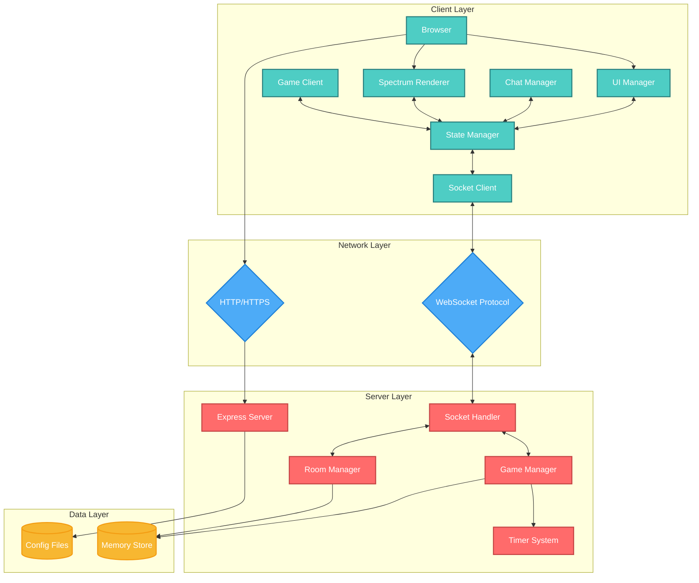
```mermaid
graph TB
    subgraph "Client Layer"
        B[Browser]:::client
        UI[UI Manager]:::client
        GC[Game Client]:::client
        SM[State Manager]:::client
        SC[Socket Client]:::client
        SR[Spectrum Renderer]:::client
        CM[Chat Manager]:::client
    end
    
    subgraph "Network Layer"
        WS{WebSocket Protocol}:::network
        HTTP{HTTP/HTTPS}:::network
    end
    
    subgraph "Server Layer"
        EX[Express Server]:::server
        SH[Socket Handler]:::server
        GM[Game Manager]:::server
        RM[Room Manager]:::server
        TS[Timer System]:::server
    end
    
    subgraph "Data Layer"
        MS[(Memory Store)]:::data
        CF[(Config Files)]:::data
    end
    
    B --> UI
    B --> SR
    UI <--> SM
    GC <--> SM
    SR <--> SM
    CM <--> SM
    SM <--> SC
    SC <--> WS
    B --> HTTP
    HTTP --> EX
    WS <--> SH
    SH <--> GM
    SH <--> RM
    GM --> TS
    RM --> MS
    GM --> MS
    EX --> CF
    
    classDef client fill:#4ECDC4,stroke:#2A7F7E,stroke-width:2px,color:#fff
    classDef server fill:#FF6B6B,stroke:#C44444,stroke-width:2px,color:#fff
    classDef network fill:#4DABF7,stroke:#1C7ED6,stroke-width:2px,color:#fff
    classDef data fill:#F7B731,stroke:#F39C12,stroke-width:2px,color:#fff
```

## Technology Stack

### Frontend Technologies

| Layer | Technology | Purpose |
|-------|------------|---------|
| Language | JavaScript ES6+ | Modern syntax, modules, async/await |
| Rendering | Canvas API 2D | Hardware-accelerated graphics |
| Styling | CSS3 | Grid layout, custom properties, animations |
| Networking | Socket.io Client | WebSocket with fallback |
| Build | Native ES Modules | No bundler required |

### Backend Technologies

| Layer | Technology | Purpose |
|-------|------------|---------|
| Runtime | Node.js 18+ | JavaScript server environment |
| Framework | Express 4.x | HTTP server and middleware |
| WebSocket | Socket.io 4.x | Real-time bidirectional events |
| Storage | In-Memory | Fast game state access |
| Process | PM2/Railway | Production process management |

## Client Architecture

### Module Hierarchy

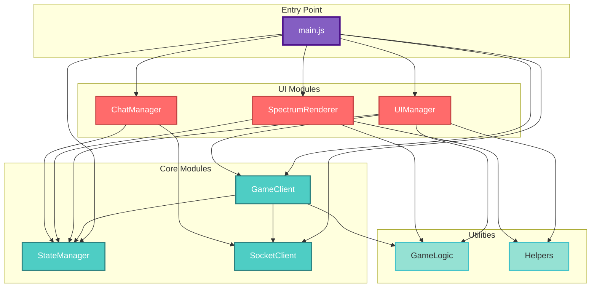
```mermaid
graph TD
    subgraph "Entry Point"
        main[main.js]:::entry
    end
    
    subgraph "Core Modules"
        SM[StateManager]:::core
        SC[SocketClient]:::core
        GC[GameClient]:::core
    end
    
    subgraph "UI Modules"
        UI[UIManager]:::ui
        SR[SpectrumRenderer]:::ui
        CM[ChatManager]:::ui
    end
    
    subgraph "Utilities"
        GL[GameLogic]:::util
        HP[Helpers]:::util
    end
    
    main --> SM
    main --> SC
    main --> GC
    main --> UI
    main --> SR
    main --> CM
    
    GC --> SM
    GC --> SC
    UI --> SM
    UI --> GC
    SR --> SM
    CM --> SM
    CM --> SC
    
    GC --> GL
    UI --> GL
    SR --> GL
    UI --> HP
    SR --> HP
    
    classDef entry fill:#845EC2,stroke:#4E148C,stroke-width:3px,color:#fff
    classDef core fill:#4ECDC4,stroke:#2A7F7E,stroke-width:2px,color:#fff
    classDef ui fill:#FF6B6B,stroke:#C44444,stroke-width:2px,color:#fff
    classDef util fill:#95E1D3,stroke:#3FC1C9,stroke-width:2px,color:#333
```

### Component Responsibilities

#### StateManager
Central state container implementing event-driven updates:

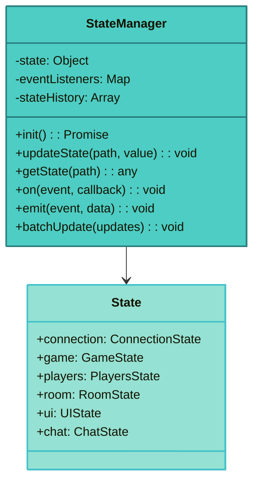
```mermaid
classDiagram
    class StateManager {
        -state: Object
        -eventListeners: Map
        -stateHistory: Array
        +init(): Promise
        +updateState(path, value): void
        +getState(path): any
        +on(event, callback): void
        +emit(event, data): void
        +batchUpdate(updates): void
    }
    
    class State {
        +connection: ConnectionState
        +game: GameState
        +players: PlayersState
        +room: RoomState
        +ui: UIState
        +chat: ChatState
    }
    
    StateManager --> State
    
    style StateManager fill:#4ECDC4,stroke:#2A7F7E,stroke-width:2px
    style State fill:#95E1D3,stroke:#3FC1C9,stroke-width:2px
```

#### GameClient
Orchestrates game logic and server communication:

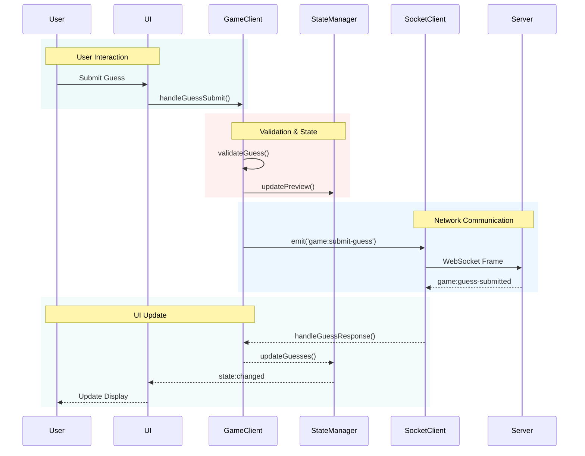
```mermaid
sequenceDiagram
    participant User
    participant UI
    participant GameClient
    participant StateManager
    participant SocketClient
    participant Server
    
    rect rgb(78, 205, 196, 0.1)
        Note over User,UI: User Interaction
        User->>UI: Submit Guess
        UI->>GameClient: handleGuessSubmit()
    end
    
    rect rgb(255, 107, 107, 0.1)
        Note over GameClient,StateManager: Validation & State
        GameClient->>GameClient: validateGuess()
        GameClient->>StateManager: updatePreview()
    end
    
    rect rgb(77, 171, 247, 0.1)
        Note over SocketClient,Server: Network Communication
        GameClient->>SocketClient: emit('game:submit-guess')
        SocketClient->>Server: WebSocket Frame
        Server-->>SocketClient: game:guess-submitted
    end
    
    rect rgb(149, 225, 211, 0.1)
        Note over GameClient,User: UI Update
        SocketClient-->>GameClient: handleGuessResponse()
        GameClient-->>StateManager: updateGuesses()
        StateManager-->>UI: state:changed
        UI-->>User: Update Display
    end
```

#### SpectrumRenderer
Canvas-based rendering system with optimization strategies:

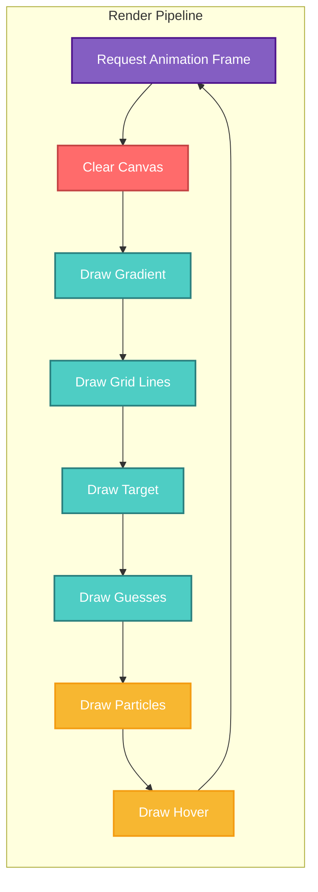
```mermaid
graph LR
    subgraph "Render Pipeline"
        RAF[Request Animation Frame]:::timing
        CLR[Clear Canvas]:::clear
        GRD[Draw Gradient]:::draw
        GRL[Draw Grid Lines]:::draw
        TGT[Draw Target]:::draw
        GSS[Draw Guesses]:::draw
        PRT[Draw Particles]:::effect
        HVR[Draw Hover]:::effect
    end
    
    RAF --> CLR
    CLR --> GRD
    GRD --> GRL
    GRL --> TGT
    TGT --> GSS
    GSS --> PRT
    PRT --> HVR
    HVR --> RAF
    
    classDef timing fill:#845EC2,stroke:#4E148C,stroke-width:2px,color:#fff
    classDef clear fill:#FF6B6B,stroke:#C44444,stroke-width:2px,color:#fff
    classDef draw fill:#4ECDC4,stroke:#2A7F7E,stroke-width:2px,color:#fff
    classDef effect fill:#F7B731,stroke:#F39C12,stroke-width:2px,color:#fff
```

### Client State Machine

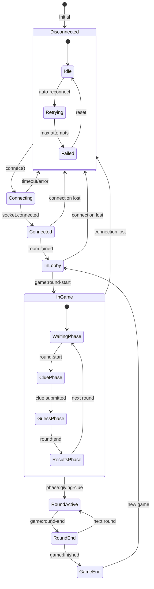
```mermaid
stateDiagram-v2
    [*] --> Disconnected: Initial
    Disconnected --> Connecting: connect()
    Connecting --> Connected: socket.connected
    Connecting --> Disconnected: timeout/error
    Connected --> InLobby: room:joined
    InLobby --> InGame: game:round-start
    InGame --> RoundActive: phase:giving-clue
    RoundActive --> RoundEnd: game:round-end
    RoundEnd --> RoundActive: next round
    RoundEnd --> GameEnd: game:finished
    GameEnd --> InLobby: new game
    
    Connected --> Disconnected: connection lost
    InLobby --> Disconnected: connection lost
    InGame --> Disconnected: connection lost
    
    state Disconnected {
        [*] --> Idle
        Idle --> Retrying: auto-reconnect
        Retrying --> Failed: max attempts
        Failed --> Idle: reset
    }
    
    state InGame {
        [*] --> WaitingPhase
        WaitingPhase --> CluePhase: round start
        CluePhase --> GuessPhase: clue submitted
        GuessPhase --> ResultsPhase: round end
        ResultsPhase --> WaitingPhase: next round
    }
```

## Server Architecture

### Server Component Model

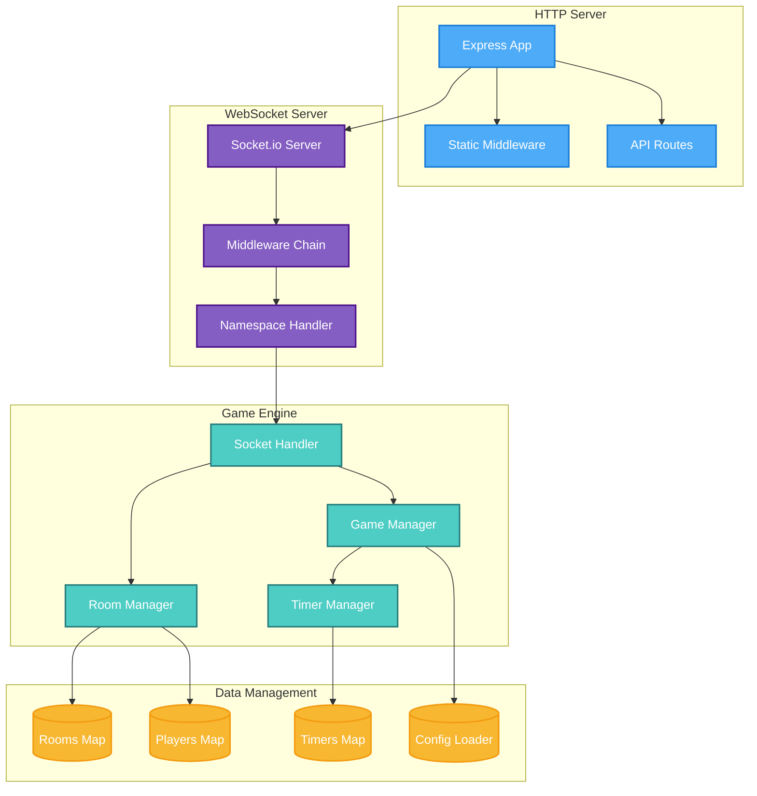
```mermaid
graph TB
    subgraph "HTTP Server"
        Express[Express App]:::http
        Static[Static Middleware]:::http
        Routes[API Routes]:::http
    end
    
    subgraph "WebSocket Server"
        IO[Socket.io Server]:::websocket
        MW[Middleware Chain]:::websocket
        NS[Namespace Handler]:::websocket
    end
    
    subgraph "Game Engine"
        SH[Socket Handler]:::game
        RM[Room Manager]:::game
        GM[Game Manager]:::game
        TM[Timer Manager]:::game
    end
    
    subgraph "Data Management"
        Rooms[(Rooms Map)]:::storage
        Players[(Players Map)]:::storage
        Timers[(Timers Map)]:::storage
        Config[(Config Loader)]:::storage
    end
    
    Express --> Static
    Express --> Routes
    Express --> IO
    IO --> MW
    MW --> NS
    NS --> SH
    
    SH --> RM
    SH --> GM
    GM --> TM
    
    RM --> Rooms
    RM --> Players
    TM --> Timers
    GM --> Config
    
    classDef http fill:#4DABF7,stroke:#1C7ED6,stroke-width:2px,color:#fff
    classDef websocket fill:#845EC2,stroke:#4E148C,stroke-width:2px,color:#fff
    classDef game fill:#4ECDC4,stroke:#2A7F7E,stroke-width:2px,color:#fff
    classDef storage fill:#F7B731,stroke:#F39C12,stroke-width:2px,color:#fff
```

### Room Lifecycle Management

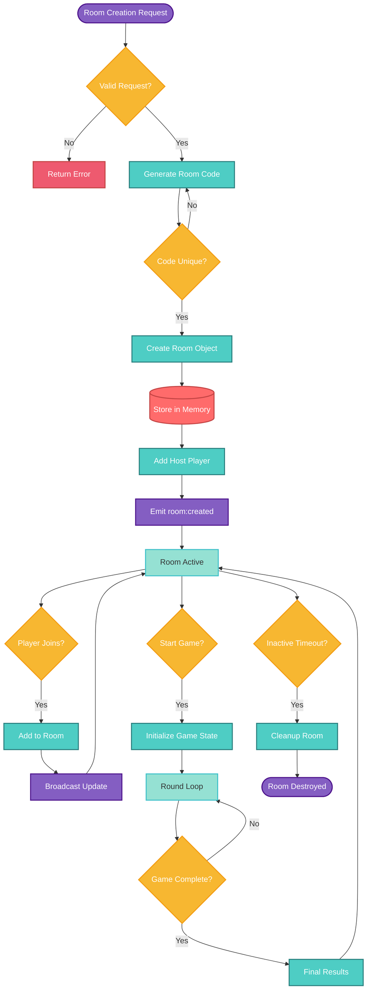
```mermaid
flowchart TD
    Start([Room Creation Request]):::event
    Start --> Validate{Valid Request?}:::decision
    Validate -->|No| Error[Return Error]:::error
    Validate -->|Yes| Generate[Generate Room Code]:::process
    Generate --> Check{Code Unique?}:::decision
    Check -->|No| Generate
    Check -->|Yes| Create[Create Room Object]:::process
    Create --> Store[(Store in Memory)]:::storage
    Store --> Join[Add Host Player]:::process
    Join --> Emit[Emit room:created]:::event
    Emit --> Active[Room Active]:::state
    
    Active --> PlayerJoin{Player Joins?}:::decision
    PlayerJoin -->|Yes| AddPlayer[Add to Room]:::process
    AddPlayer --> Broadcast[Broadcast Update]:::event
    Broadcast --> Active
    
    Active --> GameStart{Start Game?}:::decision
    GameStart -->|Yes| InitGame[Initialize Game State]:::process
    InitGame --> RoundLoop[Round Loop]:::state
    
    Active --> Timeout{Inactive Timeout?}:::decision
    Timeout -->|Yes| Cleanup[Cleanup Room]:::process
    Cleanup --> End([Room Destroyed]):::event
    
    RoundLoop --> GameEnd{Game Complete?}:::decision
    GameEnd -->|No| RoundLoop
    GameEnd -->|Yes| ShowResults[Final Results]:::process
    ShowResults --> Active
    
    classDef event fill:#845EC2,stroke:#4E148C,stroke-width:2px,color:#fff
    classDef decision fill:#F7B731,stroke:#F39C12,stroke-width:2px,color:#fff
    classDef process fill:#4ECDC4,stroke:#2A7F7E,stroke-width:2px,color:#fff
    classDef storage fill:#FF6B6B,stroke:#C44444,stroke-width:2px,color:#fff
    classDef state fill:#95E1D3,stroke:#3FC1C9,stroke-width:2px,color:#333
    classDef error fill:#EE5A6F,stroke:#C44444,stroke-width:2px,color:#fff
```

### Game Round Sequence

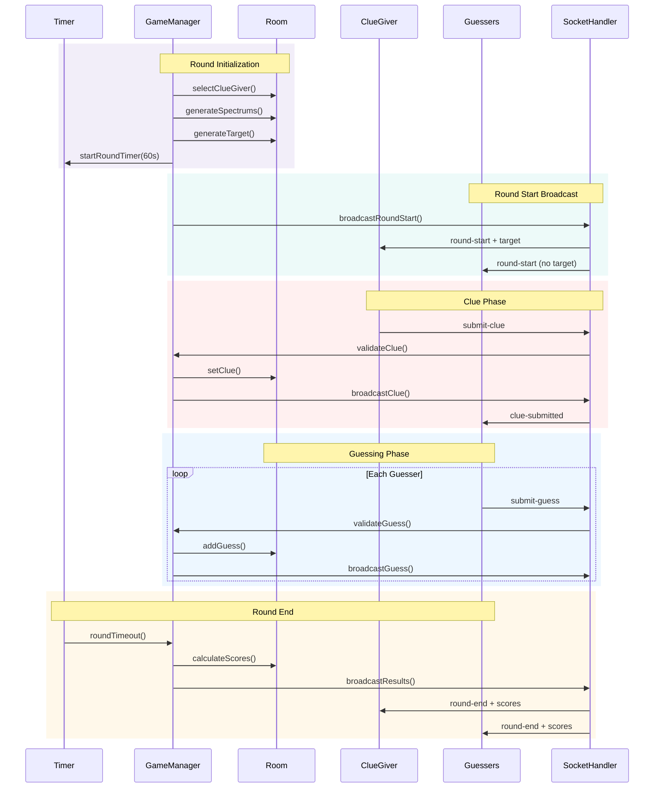
```mermaid
sequenceDiagram
    participant Timer
    participant GameManager
    participant Room
    participant ClueGiver
    participant Guessers
    participant SocketHandler
    
    rect rgb(132, 94, 194, 0.1)
        Note over GameManager,Room: Round Initialization
        GameManager->>Room: selectClueGiver()
        GameManager->>Room: generateSpectrums()
        GameManager->>Room: generateTarget()
        GameManager->>Timer: startRoundTimer(60s)
    end
    
    rect rgb(78, 205, 196, 0.1)
        Note over SocketHandler,Guessers: Round Start Broadcast
        GameManager->>SocketHandler: broadcastRoundStart()
        SocketHandler->>ClueGiver: round-start + target
        SocketHandler->>Guessers: round-start (no target)
    end
    
    rect rgb(255, 107, 107, 0.1)
        Note over ClueGiver,SocketHandler: Clue Phase
        ClueGiver->>SocketHandler: submit-clue
        SocketHandler->>GameManager: validateClue()
        GameManager->>Room: setClue()
        GameManager->>SocketHandler: broadcastClue()
        SocketHandler->>Guessers: clue-submitted
    end
    
    rect rgb(77, 171, 247, 0.1)
        Note over Guessers,Room: Guessing Phase
        loop Each Guesser
            Guessers->>SocketHandler: submit-guess
            SocketHandler->>GameManager: validateGuess()
            GameManager->>Room: addGuess()
            GameManager->>SocketHandler: broadcastGuess()
        end
    end
    
    rect rgb(247, 183, 49, 0.1)
        Note over Timer,Guessers: Round End
        Timer->>GameManager: roundTimeout()
        GameManager->>Room: calculateScores()
        GameManager->>SocketHandler: broadcastResults()
        SocketHandler->>ClueGiver: round-end + scores
        SocketHandler->>Guessers: round-end + scores
    end
```

## Data Flow

### Event Flow Architecture

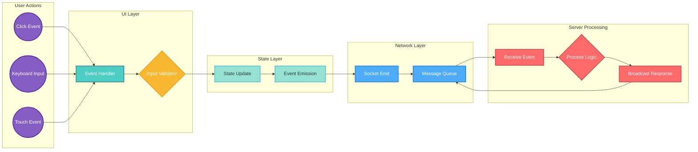
```mermaid
graph LR
    subgraph "User Actions"
        Click((Click Event)):::input
        Type((Keyboard Input)):::input
        Touch((Touch Event)):::input
    end
    
    subgraph "UI Layer"
        Handler[Event Handler]:::ui
        Validator{Input Validator}:::validation
    end
    
    subgraph "State Layer"
        StateUpdate[State Update]:::state
        EventEmit[Event Emission]:::state
    end
    
    subgraph "Network Layer"
        SocketEmit[Socket Emit]:::network
        Queue[Message Queue]:::network
    end
    
    subgraph "Server Processing"
        Receive[Receive Event]:::server
        Process{Process Logic}:::server
        Broadcast[Broadcast Response]:::server
    end
    
    Click --> Handler
    Type --> Handler
    Touch --> Handler
    Handler --> Validator
    Validator --> StateUpdate
    StateUpdate --> EventEmit
    EventEmit --> SocketEmit
    SocketEmit --> Queue
    Queue --> Receive
    Receive --> Process
    Process --> Broadcast
    Broadcast --> Queue
    
    classDef input fill:#845EC2,stroke:#4E148C,stroke-width:2px,color:#fff
    classDef ui fill:#4ECDC4,stroke:#2A7F7E,stroke-width:2px,color:#fff
    classDef validation fill:#F7B731,stroke:#F39C12,stroke-width:2px,color:#fff
    classDef state fill:#95E1D3,stroke:#3FC1C9,stroke-width:2px,color:#333
    classDef network fill:#4DABF7,stroke:#1C7ED6,stroke-width:2px,color:#fff
    classDef server fill:#FF6B6B,stroke:#C44444,stroke-width:2px,color:#fff
```

### State Synchronization

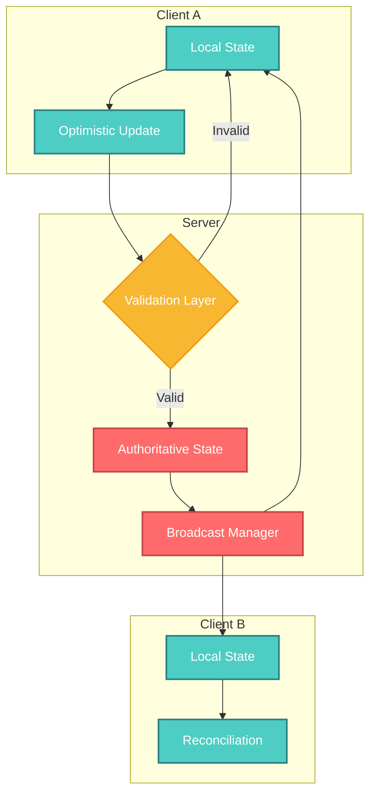
```mermaid
graph TD
    subgraph "Client A"
        StateA[Local State]:::client
        OptimisticA[Optimistic Update]:::client
    end
    
    subgraph "Server"
        Authority[Authoritative State]:::server
        Validation{Validation Layer}:::validation
        Broadcast[Broadcast Manager]:::server
    end
    
    subgraph "Client B"
        StateB[Local State]:::client
        ReconcileB[Reconciliation]:::client
    end
    
    StateA --> OptimisticA
    OptimisticA --> Validation
    Validation -->|Valid| Authority
    Validation -->|Invalid| StateA
    Authority --> Broadcast
    Broadcast --> StateB
    StateB --> ReconcileB
    Broadcast --> StateA
    
    classDef client fill:#4ECDC4,stroke:#2A7F7E,stroke-width:2px,color:#fff
    classDef server fill:#FF6B6B,stroke:#C44444,stroke-width:2px,color:#fff
    classDef validation fill:#F7B731,stroke:#F39C12,stroke-width:2px,color:#fff
```

## State Management

### State Tree Structure

```mermaid
graph TD
    Root[Application State]:::root
    
    Root --> Connection[connection]:::category
    Connection --> ConnStatus[status: 'connected']:::value
    Connection --> PlayerId[playerId: 'player_123']:::value
    Connection --> RoomCode[roomCode: 'ABC123']:::value
    
    Root --> Game[game]:::category
    Game --> Phase[phase: 'guessing']:::value
    Game --> Round[currentRound: 3]:::value
    Game --> SpecX[spectrumX: Object]:::object
    Game --> SpecY[spectrumY: Object]:::object
    Game --> Target[targetCoordinate: {x, y}]:::object
    Game --> Guesses[guesses: Map]:::collection
    
    Root --> Players[players]:::category
    Players --> P1[player_123: {name, score}]:::object
    Players --> P2[player_456: {name, score}]:::object
    
    Root --> UI[ui]:::category
    UI --> View[currentView: 'game']:::value
    UI --> Modal[activeModal: null]:::value
    UI --> Loading[loading: false]:::value
    
    Root --> Chat[chat]:::category
    Chat --> Messages[messages: Array]:::collection
    Chat --> Unread[unreadCount: 0]:::value
    
    classDef root fill:#845EC2,stroke:#4E148C,stroke-width:3px,color:#fff
    classDef category fill:#4ECDC4,stroke:#2A7F7E,stroke-width:2px,color:#fff
    classDef value fill:#95E1D3,stroke:#3FC1C9,stroke-width:2px,color:#333
    classDef object fill:#F7B731,stroke:#F39C12,stroke-width:2px,color:#fff
    classDef collection fill:#FF6B6B,stroke:#C44444,stroke-width:2px,color:#fff
```

### State Update Pattern

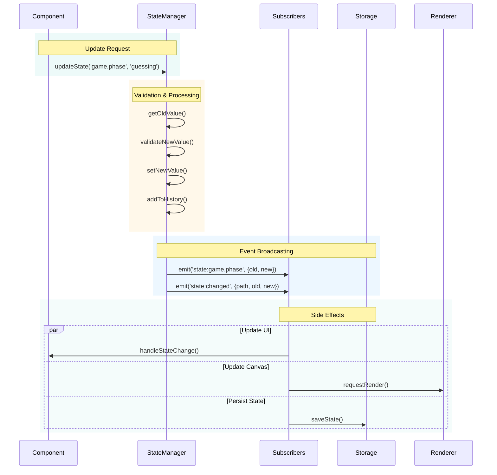
```mermaid
sequenceDiagram
    participant Component
    participant StateManager
    participant Subscribers
    participant Storage
    
    rect rgb(78, 205, 196, 0.1)
        Note over Component,StateManager: Update Request
        Component->>StateManager: updateState('game.phase', 'guessing')
    end
    
    rect rgb(247, 183, 49, 0.1)
        Note over StateManager: Validation & Processing
        StateManager->>StateManager: getOldValue()
        StateManager->>StateManager: validateNewValue()
        StateManager->>StateManager: setNewValue()
        StateManager->>StateManager: addToHistory()
    end
    
    rect rgb(77, 171, 247, 0.1)
        Note over StateManager,Storage: Event Broadcasting
        StateManager->>Subscribers: emit('state:game.phase', {old, new})
        StateManager->>Subscribers: emit('state:changed', {path, old, new})
    end
    
    rect rgb(149, 225, 211, 0.1)
        Note over Subscribers,Storage: Side Effects
        par Update UI
            Subscribers->>Component: handleStateChange()
        and Update Canvas
            Subscribers->>Renderer: requestRender()
        and Persist State
            Subscribers->>Storage: saveState()
        end
    end
```

## Network Protocol

### WebSocket Message Format

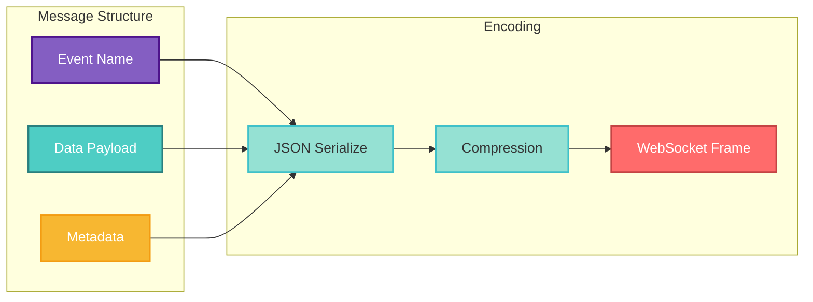
```mermaid
graph LR
    subgraph "Message Structure"
        Event[Event Name]:::header
        Payload[Data Payload]:::data
        Metadata[Metadata]:::meta
    end
    
    subgraph "Encoding"
        JSON[JSON Serialize]:::process
        Compress[Compression]:::process
        Frame[WebSocket Frame]:::output
    end
    
    Event --> JSON
    Payload --> JSON
    Metadata --> JSON
    JSON --> Compress
    Compress --> Frame
    
    classDef header fill:#845EC2,stroke:#4E148C,stroke-width:2px,color:#fff
    classDef data fill:#4ECDC4,stroke:#2A7F7E,stroke-width:2px,color:#fff
    classDef meta fill:#F7B731,stroke:#F39C12,stroke-width:2px,color:#fff
    classDef process fill:#95E1D3,stroke:#3FC1C9,stroke-width:2px,color:#333
    classDef output fill:#FF6B6B,stroke:#C44444,stroke-width:2px,color:#fff
```

### Event Protocol Specification

#### Client to Server Events

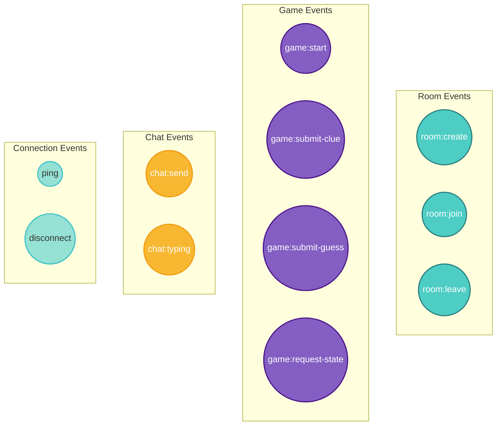
```mermaid
graph TD
    subgraph "Room Events"
        RC((room:create)):::room
        RJ((room:join)):::room
        RL((room:leave)):::room
    end
    
    subgraph "Game Events"
        GS((game:start)):::game
        GC((game:submit-clue)):::game
        GG((game:submit-guess)):::game
        GR((game:request-state)):::game
    end
    
    subgraph "Chat Events"
        CS((chat:send)):::chat
        CT((chat:typing)):::chat
    end
    
    subgraph "Connection Events"
        PN((ping)):::connection
        DC((disconnect)):::connection
    end
    
    classDef room fill:#4ECDC4,stroke:#2A7F7E,stroke-width:2px,color:#fff
    classDef game fill:#845EC2,stroke:#4E148C,stroke-width:2px,color:#fff
    classDef chat fill:#F7B731,stroke:#F39C12,stroke-width:2px,color:#fff
    classDef connection fill:#95E1D3,stroke:#3FC1C9,stroke-width:2px,color:#333
```

#### Server to Client Events

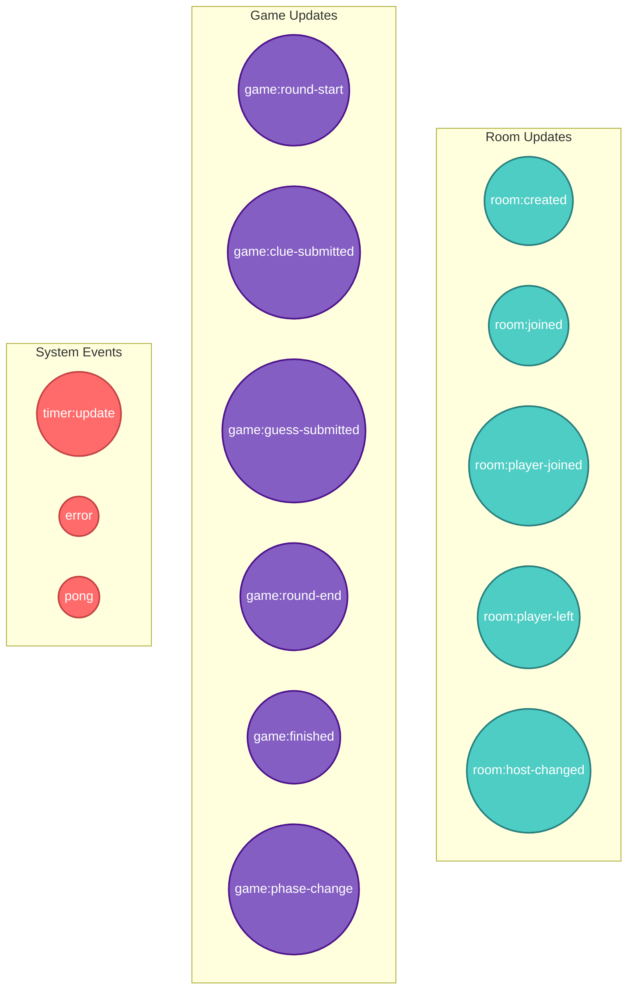
```mermaid
graph TD
    subgraph "Room Updates"
        RCR((room:created)):::room
        RJD((room:joined)):::room
        RPJ((room:player-joined)):::room
        RPL((room:player-left)):::room
        RHC((room:host-changed)):::room
    end
    
    subgraph "Game Updates"
        GRS((game:round-start)):::game
        GCS((game:clue-submitted)):::game
        GGS((game:guess-submitted)):::game
        GRE((game:round-end)):::game
        GF((game:finished)):::game
        GPU((game:phase-change)):::game
    end
    
    subgraph "System Events"
        TU((timer:update)):::system
        ER((error)):::system
        PO((pong)):::system
    end
    
    classDef room fill:#4ECDC4,stroke:#2A7F7E,stroke-width:2px,color:#fff
    classDef game fill:#845EC2,stroke:#4E148C,stroke-width:2px,color:#fff
    classDef system fill:#FF6B6B,stroke:#C44444,stroke-width:2px,color:#fff
```

### Connection Management

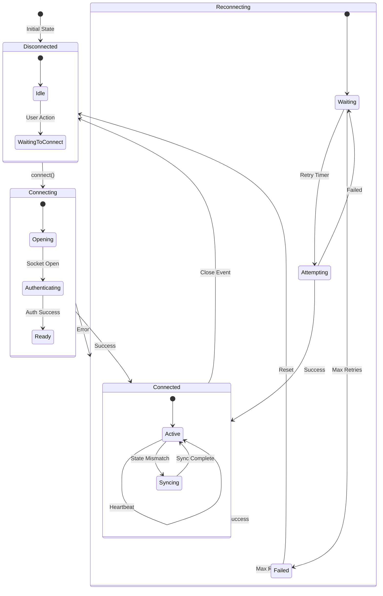
```mermaid
stateDiagram-v2
    [*] --> Disconnected: Initial State
    
    state Disconnected {
        [*] --> Idle
        Idle --> WaitingToConnect: User Action
    }
    
    Disconnected --> Connecting: connect()
    
    state Connecting {
        [*] --> Opening
        Opening --> Authenticating: Socket Open
        Authenticating --> Ready: Auth Success
    }
    
    Connecting --> Connected: Success
    Connecting --> Reconnecting: Error
    
    state Connected {
        [*] --> Active
        Active --> Active: Heartbeat
        Active --> Syncing: State Mismatch
        Syncing --> Active: Sync Complete
    }
    
    Connected --> Disconnected: Close Event
    
    state Reconnecting {
        [*] --> Waiting
        Waiting --> Attempting: Retry Timer
        Attempting --> Waiting: Failed
        Attempting --> Connected: Success
        Waiting --> Failed: Max Retries
    }
    
    Reconnecting --> Connected: Retry Success
    Reconnecting --> Failed: Max Retries
    Failed --> Disconnected: Reset
```

## Rendering Pipeline

### Canvas Render Loop

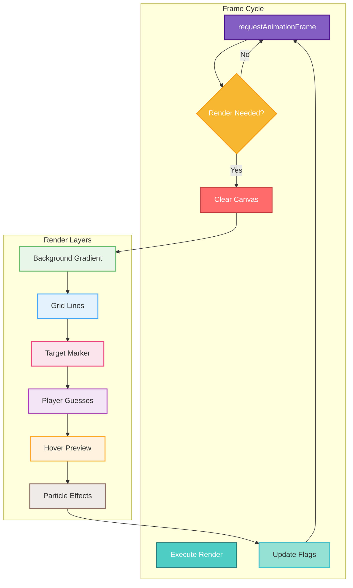
```mermaid
graph TD
    subgraph "Frame Cycle"
        RAF[requestAnimationFrame]:::timing
        Check{Render Needed?}:::decision
        Clear[Clear Canvas]:::clear
        Render[Execute Render]:::render
        Update[Update Flags]:::update
    end
    
    subgraph "Render Layers"
        BG[Background Gradient]:::layer1
        Grid[Grid Lines]:::layer2
        Target[Target Marker]:::layer3
        Guesses[Player Guesses]:::layer4
        Preview[Hover Preview]:::layer5
        Effects[Particle Effects]:::layer6
    end
    
    RAF --> Check
    Check -->|Yes| Clear
    Check -->|No| RAF
    Clear --> BG
    BG --> Grid
    Grid --> Target
    Target --> Guesses
    Guesses --> Preview
    Preview --> Effects
    Effects --> Update
    Update --> RAF
    
    classDef timing fill:#845EC2,stroke:#4E148C,stroke-width:2px,color:#fff
    classDef decision fill:#F7B731,stroke:#F39C12,stroke-width:2px,color:#fff
    classDef clear fill:#FF6B6B,stroke:#C44444,stroke-width:2px,color:#fff
    classDef render fill:#4ECDC4,stroke:#2A7F7E,stroke-width:2px,color:#fff
    classDef update fill:#95E1D3,stroke:#3FC1C9,stroke-width:2px,color:#333
    classDef layer1 fill:#E8F5E9,stroke:#66BB6A,stroke-width:2px,color:#333
    classDef layer2 fill:#E3F2FD,stroke:#42A5F5,stroke-width:2px,color:#333
    classDef layer3 fill:#FCE4EC,stroke:#EC407A,stroke-width:2px,color:#333
    classDef layer4 fill:#F3E5F5,stroke:#AB47BC,stroke-width:2px,color:#333
    classDef layer5 fill:#FFF3E0,stroke:#FFA726,stroke-width:2px,color:#333
    classDef layer6 fill:#EFEBE9,stroke:#8D6E63,stroke-width:2px,color:#333
```

### Coordinate System

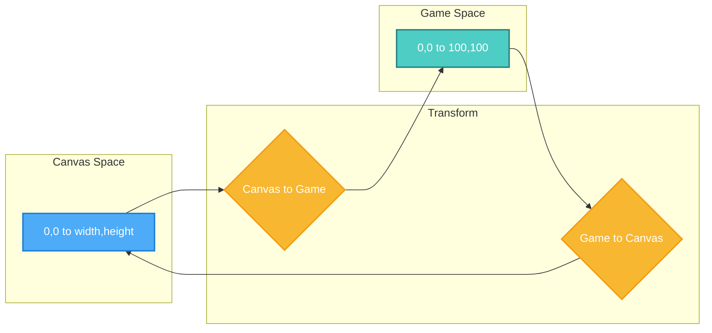
```mermaid
graph LR
    subgraph "Canvas Space"
        CS[0,0 to width,height]:::canvas
    end
    
    subgraph "Game Space"
        GS[0,0 to 100,100]:::game
    end
    
    subgraph "Transform"
        CTG{Canvas to Game}:::transform
        GTC{Game to Canvas}:::transform
    end
    
    CS --> CTG
    CTG --> GS
    GS --> GTC
    GTC --> CS
    
    classDef canvas fill:#4DABF7,stroke:#1C7ED6,stroke-width:2px,color:#fff
    classDef game fill:#4ECDC4,stroke:#2A7F7E,stroke-width:2px,color:#fff
    classDef transform fill:#F7B731,stroke:#F39C12,stroke-width:2px,color:#fff
```

### Performance Optimizations

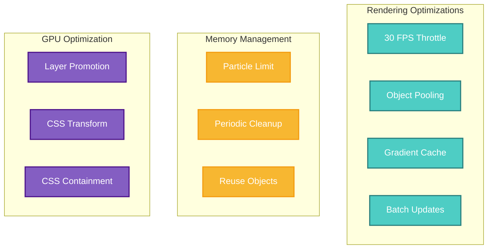
```mermaid
graph TD
    subgraph "Rendering Optimizations"
        Throttle[30 FPS Throttle]:::perf
        Pool[Object Pooling]:::perf
        Cache[Gradient Cache]:::perf
        Batch[Batch Updates]:::perf
    end
    
    subgraph "Memory Management"
        Limit[Particle Limit]:::memory
        Cleanup[Periodic Cleanup]:::memory
        Reuse[Reuse Objects]:::memory
    end
    
    subgraph "GPU Optimization"
        Layer[Layer Promotion]:::gpu
        Transform[CSS Transform]:::gpu
        Contain[CSS Containment]:::gpu
    end
    
    classDef perf fill:#4ECDC4,stroke:#2A7F7E,stroke-width:2px,color:#fff
    classDef memory fill:#F7B731,stroke:#F39C12,stroke-width:2px,color:#fff
    classDef gpu fill:#845EC2,stroke:#4E148C,stroke-width:2px,color:#fff
```

## Security Model

### Input Validation Flow

```mermaid
flowchart TD
    Input[User Input]:::input
    Client{Client Validation}:::validation
    Network[Network Transport]:::network
    Server{Server Validation}:::validation
    Process[Process Action]:::success
    Reject[Reject Action]:::error
    
    Input --> Client
    Client -->|Valid| Network
    Client -->|Invalid| Reject
    Network --> Server
    Server -->|Valid| Process
    Server -->|Invalid| Reject
    
    classDef input fill:#845EC2,stroke:#4E148C,stroke-width:2px,color:#fff
    classDef validation fill:#F7B731,stroke:#F39C12,stroke-width:2px,color:#fff
    classDef network fill:#4DABF7,stroke:#1C7ED6,stroke-width:2px,color:#fff
    classDef success fill:#4ECDC4,stroke:#2A7F7E,stroke-width:2px,color:#fff
    classDef error fill:#FF6B6B,stroke:#C44444,stroke-width:2px,color:#fff
```

### Security Layers

```mermaid
graph TB
    subgraph "Client Security"
        XV[XSS Prevention]:::client
        IV[Input Validation]:::client
        RL[Rate Limiting]:::client
    end
    
    subgraph "Transport Security"
        TLS[TLS/SSL]:::transport
        WS[WSS Protocol]:::transport
    end
    
    subgraph "Server Security"
        Auth[Authentication]:::server
        Val[Validation]:::server
        San[Sanitization]:::server
        Lim[Rate Limiting]:::server
    end
    
    subgraph "Game Security"
        Room[Room Isolation]:::game
        Perm[Permission Check]:::game
        State[State Validation]:::game
    end
    
    classDef client fill:#4ECDC4,stroke:#2A7F7E,stroke-width:2px,color:#fff
    classDef transport fill:#4DABF7,stroke:#1C7ED6,stroke-width:2px,color:#fff
    classDef server fill:#FF6B6B,stroke:#C44444,stroke-width:2px,color:#fff
    classDef game fill:#845EC2,stroke:#4E148C,stroke-width:2px,color:#fff
```

## Performance Optimizations

### Client Optimization Strategies

```mermaid
graph LR
    subgraph "Rendering"
        RAF((RAF Throttle)):::timing
        Pool((Object Pool)):::memory
        Cache((Cache Reuse)):::storage
    end
    
    subgraph "State"
        Batch((Batch Updates)):::process
        Debounce((Debounce Events)):::timing
        Memo((Memoization)):::storage
    end
    
    subgraph "Network"
        Queue((Message Queue)):::network
        Compress((Compression)):::process
        Retry((Smart Retry)):::network
    end
    
    classDef timing fill:#845EC2,stroke:#4E148C,stroke-width:2px,color:#fff
    classDef memory fill:#F7B731,stroke:#F39C12,stroke-width:2px,color:#fff
    classDef storage fill:#4ECDC4,stroke:#2A7F7E,stroke-width:2px,color:#fff
    classDef process fill:#95E1D3,stroke:#3FC1C9,stroke-width:2px,color:#333
    classDef network fill:#4DABF7,stroke:#1C7ED6,stroke-width:2px,color:#fff
```

### Server Optimization Strategies

```mermaid
graph LR
    subgraph "Memory"
        Cleanup((Room Cleanup)):::memory
        Buffer((Circular Buffers)):::memory
        Pool((Connection Pool)):::memory
    end
    
    subgraph "Processing"
        Async((Async Operations)):::process
        Cache((Result Cache)):::storage
        Batch((Batch Broadcasts)):::process
    end
    
    subgraph "Network"
        Binary((Binary Protocol)):::network
        Compress((Compression)):::network
        CDN((Static CDN)):::network
    end
    
    classDef memory fill:#F7B731,stroke:#F39C12,stroke-width:2px,color:#fff
    classDef process fill:#4ECDC4,stroke:#2A7F7E,stroke-width:2px,color:#fff
    classDef storage fill:#95E1D3,stroke:#3FC1C9,stroke-width:2px,color:#333
    classDef network fill:#4DABF7,stroke:#1C7ED6,stroke-width:2px,color:#fff
```

## Deployment Architecture

### Production Infrastructure

```mermaid
graph TB
    subgraph "Client Delivery"
        CDN[CloudFlare CDN]:::cdn
        Static[Static Assets]:::static
    end
    
    subgraph "Railway Platform"
        LB[Load Balancer]:::network
        App1[App Instance 1]:::app
        App2[App Instance 2]:::app
        App3[App Instance 3]:::app
    end
    
    subgraph "Monitoring"
        Logs[(Log Aggregation)]:::data
        Metrics[Performance Metrics]:::monitor
        Alerts[Alert System]:::alert
    end
    
    CDN --> Static
    Static --> LB
    LB --> App1
    LB --> App2
    LB --> App3
    
    App1 --> Logs
    App2 --> Logs
    App3 --> Logs
    
    Logs --> Metrics
    Metrics --> Alerts
    
    classDef cdn fill:#95E1D3,stroke:#3FC1C9,stroke-width:2px,color:#333
    classDef static fill:#E8F5E9,stroke:#66BB6A,stroke-width:2px,color:#333
    classDef network fill:#4DABF7,stroke:#1C7ED6,stroke-width:2px,color:#fff
    classDef app fill:#4ECDC4,stroke:#2A7F7E,stroke-width:2px,color:#fff
    classDef data fill:#F7B731,stroke:#F39C12,stroke-width:2px,color:#fff
    classDef monitor fill:#845EC2,stroke:#4E148C,stroke-width:2px,color:#fff
    classDef alert fill:#FF6B6B,stroke:#C44444,stroke-width:2px,color:#fff
```

### Scaling Strategy

```mermaid
graph TD
    subgraph "Current Architecture"
        Single[Single Server]:::current
        Memory[(In-Memory State)]:::current
    end
    
    subgraph "Scaled Architecture"
        Multi[Multiple Servers]:::scaled
        Redis[(Redis State)]:::scaled
        Sticky[Sticky Sessions]:::scaled
    end
    
    subgraph "Future Architecture"
        Micro[Microservices]:::future
        Queue[Message Queue]:::future
        DB[(Persistent DB)]:::future
    end
    
    Single --> Multi
    Memory --> Redis
    Multi --> Sticky
    
    Multi --> Micro
    Redis --> Queue
    Queue --> DB
    
    classDef current fill:#4ECDC4,stroke:#2A7F7E,stroke-width:2px,color:#fff
    classDef scaled fill:#F7B731,stroke:#F39C12,stroke-width:2px,color:#fff
    classDef future fill:#845EC2,stroke:#4E148C,stroke-width:2px,color:#fff
```

## API Reference

### REST Endpoints

| Method | Endpoint | Purpose | Response |
|--------|----------|---------|----------|
| GET | `/health` | Health check | `{status, uptime, stats}` |
| GET | `/api/spectrums` | List spectrums | `{categories, spectrums}` |
| GET | `/api/stats` | Game statistics | `{rooms, players, games}` |

### WebSocket Events Reference

#### Connection Events
```javascript
// Client → Server
socket.emit('ping', timestamp);

// Server → Client
socket.on('pong', (timestamp) => {
    const latency = Date.now() - timestamp;
});
```

#### Room Management
```javascript
// Create Room
socket.emit('room:create', {
    playerName: 'Alice',
    settings: { maxPlayers: 4 }
});

// Join Room
socket.emit('room:join', {
    playerName: 'Bob',
    roomCode: 'ABC123'
});
```

#### Game Actions
```javascript
// Submit Clue
socket.emit('game:submit-clue', {
    clue: 'Somewhere in the middle'
});

// Submit Guess
socket.emit('game:submit-guess', {
    coordinate: { x: 50, y: 50 }
});
```

### Error Codes

| Code | Description | Recovery |
|------|-------------|----------|
| `ROOM_NOT_FOUND` | Invalid room code | Prompt for new code |
| `ROOM_FULL` | Maximum players reached | Try different room |
| `INVALID_PHASE` | Action not allowed in phase | Wait for correct phase |
| `VALIDATION_ERROR` | Input validation failed | Correct input format |
| `CONNECTION_ERROR` | Network issue | Auto-reconnect |

## Development Guidelines

### Code Organization

```mermaid
graph TD
    subgraph "Module Structure"
        Class[Class Definition]:::structure
        Props[Properties]:::structure
        Init[Initialization]:::structure
        Public[Public Methods]:::structure
        Private[Private Methods]:::structure
        Events[Event Handlers]:::structure
        Utils[Utilities]:::structure
    end
    
    Class --> Props
    Props --> Init
    Init --> Public
    Public --> Private
    Private --> Events
    Events --> Utils
    
    classDef structure fill:#95E1D3,stroke:#3FC1C9,stroke-width:2px,color:#333
```

### Testing Strategy

```mermaid
graph LR
    subgraph "Test Pyramid"
        Unit[Unit Tests]:::test1
        Integration[Integration Tests]:::test2
        E2E[E2E Tests]:::test3
    end
    
    subgraph "Coverage Areas"
        Logic[Game Logic]:::area
        State[State Management]:::area
        Network[Network Layer]:::area
        UI[UI Components]:::area
    end
    
    Unit --> Logic
    Unit --> State
    Integration --> Network
    E2E --> UI
    
    classDef test1 fill:#4ECDC4,stroke:#2A7F7E,stroke-width:2px,color:#fff
    classDef test2 fill:#F7B731,stroke:#F39C12,stroke-width:2px,color:#fff
    classDef test3 fill:#845EC2,stroke:#4E148C,stroke-width:2px,color:#fff
    classDef area fill:#95E1D3,stroke:#3FC1C9,stroke-width:2px,color:#333
```

---

This architecture documentation provides a comprehensive technical overview of the Spectrum game system, enabling developers to understand, maintain, and extend the codebase effectively.