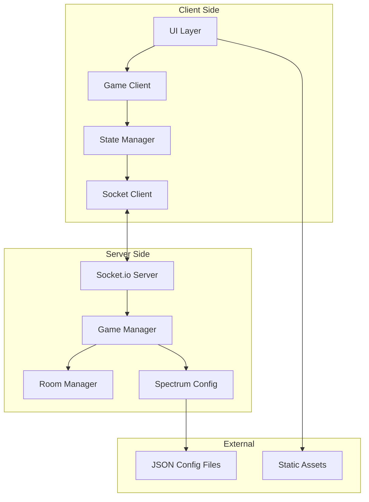
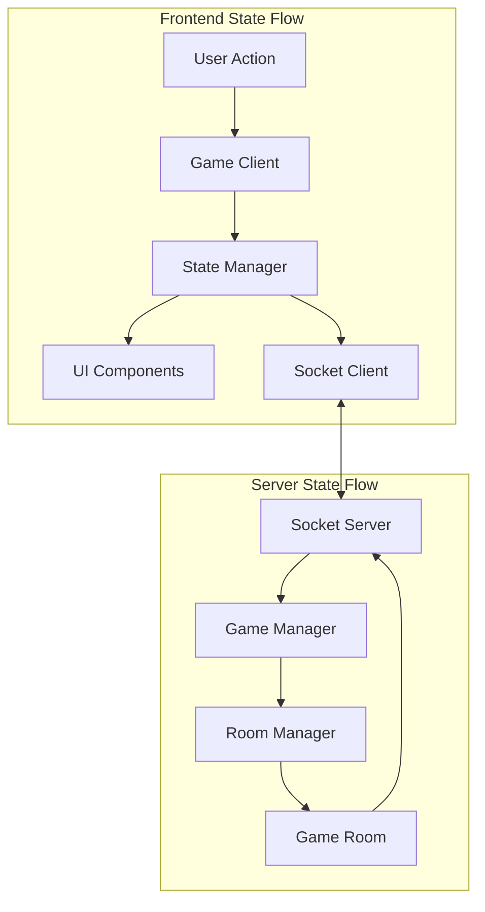
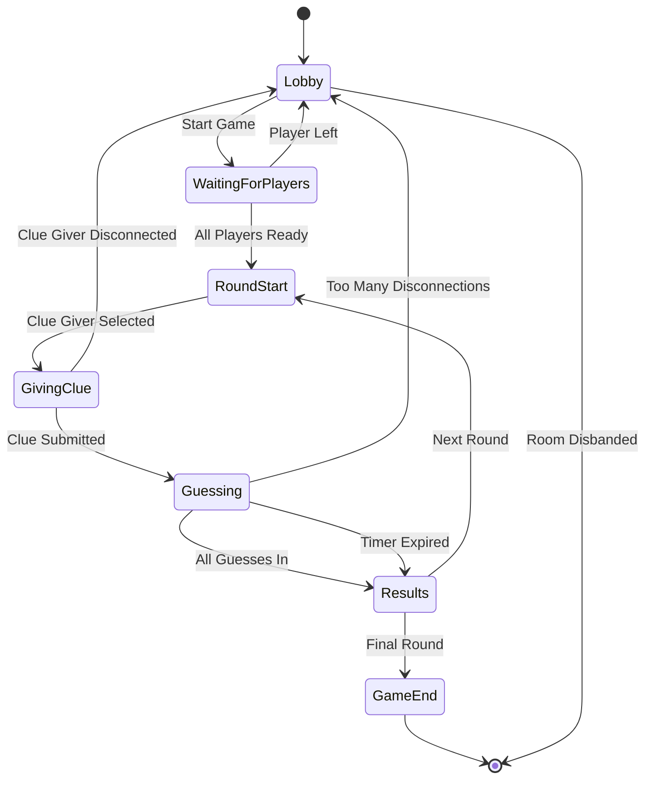
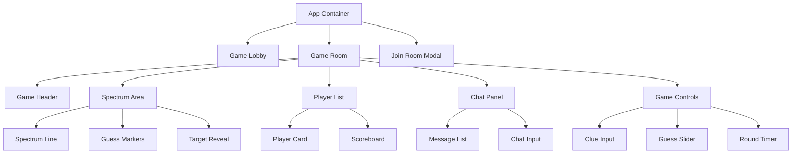
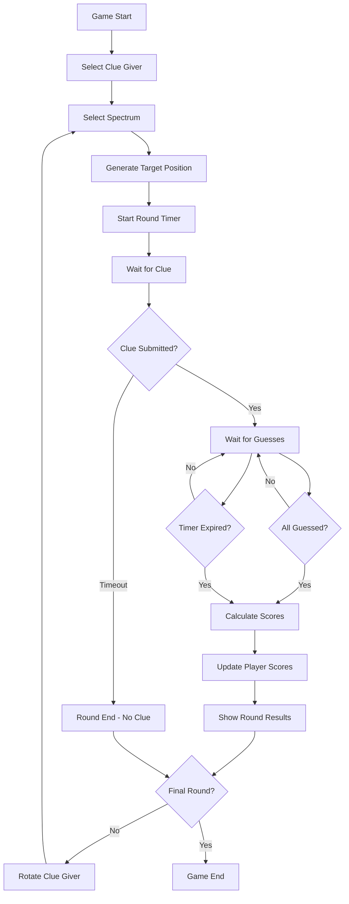
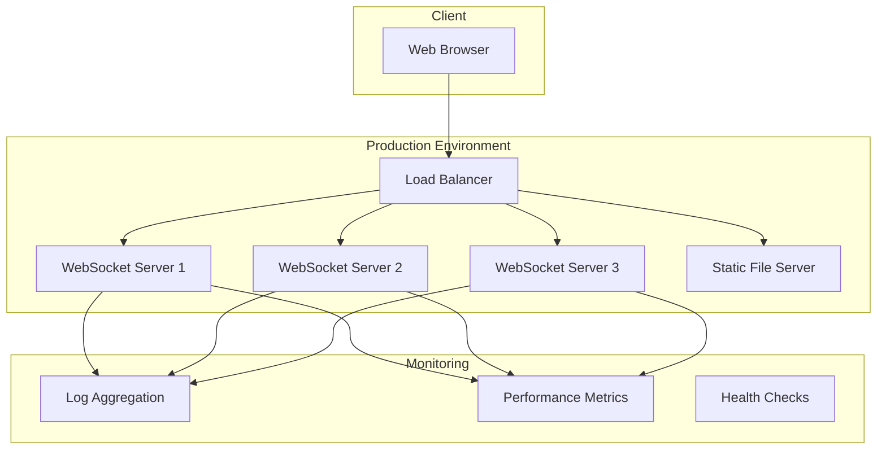

# Spectrum Game - System Architecture

## Overview

Spectrum is a multiplayer web guessing game built with vanilla JavaScript frontend and Node.js/Socket.io backend. Players join rooms and take turns as "Clue Giver" to guess locations on various spectrums.

## System Architecture Diagram



## Component Relationships

### Frontend Components
- **UI Layer**: Handles DOM manipulation, animations, and user interactions
- **Game Client**: Manages game logic, user actions, and UI updates
- **State Manager**: Centralized state management with event-driven updates
- **Socket Client**: WebSocket communication with server

### Backend Components
- **Socket.io Server**: Real-time communication hub
- **Game Manager**: Core game logic and rule enforcement
- **Room Manager**: Room creation, joining, and lifecycle management
- **Spectrum Config**: Loads and manages spectrum definitions

## File Structure

```

## Core Module Definitions

### Frontend Modules

#### GameClient.js
**Responsibilities:**
- Coordinate game flow and user interactions
- Manage game state transitions
- Handle user input validation
- Trigger UI updates through StateManager

**Key Methods:**
- `joinRoom(roomCode)` - Join existing room
- `createRoom()` - Create new room
- `submitGuess(position)` - Submit player guess
- `sendClue(clueText)` - Send clue as Clue Giver
- `startNewRound()` - Initialize new game round

#### StateManager.js
**Responsibilities:**
- Centralized state management with event system
- Emit state change events to UI components
- Maintain game state consistency
- Handle state synchronization with server

**Key Properties:**
- `gameState` - Current game phase
- `players` - Player list and scores
- `currentSpectrum` - Active spectrum data
- `roundTimer` - Timer state
- `chatMessages` - Chat history

#### SocketClient.js
**Responsibilities:**
- WebSocket connection management
- Message serialization/deserialization
- Connection retry logic
- Event routing to appropriate handlers

**Key Events:**
- `room:joined` - Successfully joined room
- `game:state-update` - Game state changed
- `player:guess` - Player submitted guess
- `chat:message` - New chat message
- `round:timer` - Timer updates

#### UIManager.js
**Responsibilities:**
- DOM manipulation and event binding
- Coordinate between UI components
- Handle responsive layout changes
- Manage modal dialogs and overlays

#### SpectrumRenderer.js
**Responsibilities:**
- Render interactive spectrum line
- Handle guess placement animations
- Display target point and guesses
- Manage spectrum visual effects

**Key Features:**
- Smooth gradient backgrounds
- Animated guess placement
- Target reveal animations
- Responsive spectrum scaling

### Backend Modules

#### GameManager.js
**Responsibilities:**
- Enforce game rules and logic
- Calculate scores and bonuses
- Manage round timing
- Validate player actions

**Key Methods:**
- `startRound(roomId)` - Begin new round
- `processGuess(playerId, position)` - Handle guess submission
- `calculateScores(guesses, target)` - Score calculation
- `endRound(roomId)` - Complete round and show results

#### RoomManager.js
**Responsibilities:**
- Room lifecycle management
- Player join/leave handling
- Room code generation
- Room cleanup

**Key Properties:**
- `rooms` - Active rooms map
- `playerRooms` - Player to room mapping
- `roomCodes` - Generated room codes

#### GameRoom.js
**Responsibilities:**
- Individual room state management
- Player role assignment
- Round progression
- Chat message handling

**Key Properties:**
- `id` - Unique room identifier
- `players` - Room player list
- `currentGiver` - Active Clue Giver
- `spectrum` - Current spectrum
- `guesses` - Player guesses
- `roundStartTime` - Round timer

#### Player.js
**Responsibilities:**
- Player data management
- Score tracking
- Connection state
- Role management

**Key Properties:**
- `id` - Unique player identifier
- `name` - Player display name
- `score` - Total score
- `isConnected` - Connection status
- `role` - Current role (giver/guesser)

## Data Flow and State Management

### State Management Architecture



### Frontend State Structure

```javascript
// StateManager state schema
{
  connection: {
    status: 'connected' | 'disconnected' | 'reconnecting',
    playerId: string,
    roomCode: string
  },
  game: {
    phase: 'lobby' | 'waiting' | 'giving-clue' | 'guessing' | 'results',
    currentRound: number,
    totalRounds: number,
    timeRemaining: number,
    spectrum: SpectrumData,
    clue: string,
    targetPosition: number // Only visible to Clue Giver
  },
  players: {
    [playerId]: {
      id: string,
      name: string,
      score: number,
      isClueGiver: boolean,
      hasGuessed: boolean,
      guess: number | null,
      isConnected: boolean
    }
  },
  ui: {
    activeModal: string | null,
    chatVisible: boolean,
    scoreboardVisible: boolean,
    notifications: NotificationData[]
  },
  chat: {
    messages: ChatMessage[],
    unreadCount: number
  }
}
```

### Server State Structure

```javascript
// GameRoom state schema
{
  id: string,
  code: string,
  players: Map<string, Player>,
  gameState: {
    phase: 'lobby' | 'active' | 'finished',
    currentRound: number,
    roundStartTime: number,
    clueGiverId: string,
    spectrum: SpectrumData,
    targetPosition: number,
    clue: string,
    guesses: Map<string, number>,
    scores: Map<string, number>
  },
  settings: {
    maxPlayers: number,
    roundDuration: number,
    totalRounds: number
  }
}
```

### Event-Driven State Updates

**Frontend Event Flow:**
1. User action triggers GameClient method
2. GameClient validates action and updates StateManager
3. StateManager emits state change events
4. UI components listen for relevant events and update
5. SocketClient sends server updates when needed

**Server Event Flow:**
1. Socket message received by GameManager
2. GameManager validates and processes action
3. GameRoom state updated
4. State changes broadcast to all room players
5. Client StateManagers receive updates and emit events

### State Synchronization Strategy

**Optimistic Updates:**
- UI updates immediately for user actions
- Server validation confirms or reverts changes
- Conflict resolution prioritizes server state

**Real-time Synchronization:**
- Timer updates broadcast every second
- Game state changes pushed immediately
- Player actions synchronized across all clients

**Connection Recovery:**
- Full state sync on reconnection
- Missed events replayed from server
- Graceful degradation for offline periods

## WebSocket API Specification

### Connection Events

#### Client → Server

**`room:create`**
```javascript
{
  playerName: string,
  settings?: {
    maxPlayers: number,
    roundDuration: number
  }
}
```

**`room:join`**
```javascript
{
  roomCode: string,
  playerName: string
}
```

**`game:start`**
```javascript
{
  roomId: string
}
```

**`game:submit-clue`**
```javascript
{
  roomId: string,
  clue: string
}
```

**`game:submit-guess`**
```javascript
{
  roomId: string,
  position: number // 0-100
}
```

**`chat:send`**
```javascript
{
  roomId: string,
  message: string
}
```

**`player:disconnect`**
```javascript
{
  roomId: string,
  playerId: string
}
```

#### Server → Client

**`room:created`**
```javascript
{
  roomId: string,
  roomCode: string,
  playerId: string,
  players: Player[]
}
```

**`room:joined`**
```javascript
{
  roomId: string,
  playerId: string,
  players: Player[],
  gameState: GameState
}
```

**`room:player-joined`**
```javascript
{
  player: Player
}
```

**`room:player-left`**
```javascript
{
  playerId: string
}
```

**`game:state-update`**
```javascript
{
  phase: string,
  currentRound: number,
  timeRemaining: number,
  clueGiverId: string,
  spectrum: SpectrumData,
  clue?: string
}
```

**`game:round-start`**
```javascript
{
  roundNumber: number,
  clueGiverId: string,
  spectrum: SpectrumData,
  targetPosition?: number, // Only sent to Clue Giver
  duration: number
}
```

**`game:clue-submitted`**
```javascript
{
  clue: string,
  clueGiverId: string
}
```

**`game:guess-submitted`**
```javascript
{
  playerId: string,
  hasGuessed: boolean // Position hidden until round end
}
```

**`game:round-end`**
```javascript
{
  targetPosition: number,
  guesses: {
    [playerId]: {
      position: number,
      score: number,
      distance: number
    }
  },
  roundScores: { [playerId]: number },
  totalScores: { [playerId]: number },
  bonusAwarded: boolean
}
```

**`game:finished`**
```javascript
{
  finalScores: { [playerId]: number },
  winner: string,
  gameStats: GameStats
}
```

**`chat:message`**
```javascript
{
  playerId: string,
  playerName: string,
  message: string,
  timestamp: number
}
```

**`timer:update`**
```javascript
{
  timeRemaining: number,
  phase: string
}
```

**`error`**
```javascript
{
  code: string,
  message: string,
  details?: any
}
```

### Error Codes

- `ROOM_NOT_FOUND` - Room code invalid
- `ROOM_FULL` - Room at capacity
- `GAME_IN_PROGRESS` - Cannot join active game
- `INVALID_ACTION` - Action not allowed in current state
- `PLAYER_NOT_FOUND` - Player not in room
- `INVALID_GUESS` - Guess outside valid range
- `CLUE_TOO_LONG` - Clue exceeds character limit

## Spectrum Configuration System

### Spectrum Data Structure

```javascript
// spectrums.json
{
  "spectrums": [
    {
      "id": "temperature",
      "name": "Temperature",
      "leftLabel": "Freezing Cold",
      "rightLabel": "Blazing Hot",
      "leftValue": "❄️ Arctic",
      "rightValue": "🔥 Desert",
      "gradient": {
        "start": "#4FC3F7",
        "middle": "#81C784", 
        "end": "#FF8A65"
      },
      "category": "physical",
      "difficulty": "easy"
    },
    {
      "id": "emotion-happiness",
      "name": "Emotional State",
      "leftLabel": "Deeply Sad",
      "rightLabel": "Extremely Happy",
      "leftValue": "😢 Heartbroken",
      "rightValue": "😄 Ecstatic",
      "gradient": {
        "start": "#7986CB",
        "middle": "#AED581",
        "end": "#FFD54F"
      },
      "category": "emotional",
      "difficulty": "medium"
    },
    {
      "id": "time-period",
      "name": "Historical Era",
      "leftLabel": "Ancient Past",
      "rightLabel": "Far Future",
      "leftValue": "🏛️ Stone Age",
      "rightValue": "🚀 Space Age",
      "gradient": {
        "start": "#8D6E63",
        "middle": "#90A4AE",
        "end": "#CE93D8"
      },
      "category": "abstract",
      "difficulty": "hard"
    }
  ],
  "categories": {
    "physical": {
      "name": "Physical Properties",
      "color": "#4FC3F7",
      "description": "Tangible, measurable qualities"
    },
    "emotional": {
      "name": "Emotions & Feelings", 
      "color": "#81C784",
      "description": "Emotional states and moods"
    },
    "abstract": {
      "name": "Abstract Concepts",
      "color": "#CE93D8", 
      "description": "Complex ideas and concepts"
    }
  }
}
```

### Configuration Loading Strategy

**Server-side Loading:**
- Load all spectrums at server startup
- Validate spectrum data structure
- Cache in memory for fast access
- Support hot-reloading for development

**Client-side Access:**
- Receive spectrum data with game state
- Cache current spectrum locally
- No direct access to full spectrum list

### Spectrum Selection Algorithm

```javascript
// Spectrum selection logic
function selectSpectrum(players, previousSpectrums, difficulty) {
  const availableSpectrums = spectrums.filter(s => 
    !previousSpectrums.includes(s.id) &&
    s.difficulty <= difficulty
  );
  
  // Ensure variety across categories
  const categoryBalance = getCategoryBalance(previousSpectrums);
  const preferredCategories = getLeastUsedCategories(categoryBalance);
  
  const filteredSpectrums = availableSpectrums.filter(s =>
    preferredCategories.includes(s.category)
  );
  
  return getRandomSpectrum(filteredSpectrums.length > 0 ? 
    filteredSpectrums : availableSpectrums);
}
```

### Expandability Features

**Easy Addition:**
- JSON-based configuration
- No code changes required
- Automatic validation
- Category-based organization

**Validation Rules:**
- Required fields: id, name, leftLabel, rightLabel, gradient
- Gradient must have start/end colors
- ID must be unique
- Labels must be non-empty strings

**Future Extensions:**
- Custom difficulty algorithms
- Player preference tracking
- Dynamic spectrum generation
- Localization support

- `ROUND_EXPIRED` - Action submitted after round end
spectrum/
├── client/
│   ├── index.html
│   ├── css/
│   │   ├── main.css
│   │   ├── components/
│   │   │   ├── spectrum.css
│   │   │   ├── chat.css
│   │   │   ├── scoreboard.css
│   │   │   └── room.css
│   │   └── animations.css
│   ├── js/
│   │   ├── main.js
│   │   ├── core/
│   │   │   ├── GameClient.js
│   │   │   ├── StateManager.js
│   │   │   └── SocketClient.js
│   │   ├── ui/
│   │   │   ├── UIManager.js
│   │   │   ├── SpectrumRenderer.js
│   │   │   ├── ChatManager.js
│   │   │   ├── ScoreboardManager.js
│   │   │   └── RoomManager.js
│   │   ├── utils/
│   │   │   ├── animations.js
│   │   │   ├── helpers.js
│   │   │   └── constants.js
│   │   └── config/
│   │       └── client-config.js
│   └── assets/
│       ├── images/
│       └── sounds/
├── server/
│   ├── server.js
│   ├── core/
│   │   ├── GameManager.js
│   │   ├── RoomManager.js
│   │   ├── Player.js
│   │   └── GameRoom.js
│   ├── config/
│   │   ├── spectrums.json
│   │   └── server-config.js
│   ├── utils/
│   │   ├── helpers.js
│   │   └── validation.js
│   └── events/
│       └── socketHandlers.js
├── package.json
├── package-lock.json
└── README.md
```

## Game State Management and Synchronization

### Game Flow State Machine



### Synchronization Strategy

**State Authority:**
- Server is authoritative for all game state
- Client state is optimistic with server validation
- Conflicts resolved in favor of server state

**Real-time Updates:**
- Game phase transitions broadcast immediately
- Timer updates sent every second
- Player actions synchronized across all clients
- Chat messages delivered in real-time

**Connection Management:**
- Graceful handling of player disconnections
- Automatic reconnection with state recovery
- Game pause for critical player disconnections
- Room cleanup after extended inactivity

### State Persistence Strategy

**In-Memory Storage:**
- Active game rooms stored in server memory
- Player sessions maintained during connections
- Game history discarded after completion
- No database persistence required

**State Recovery:**
- Full state sync on player reconnection
- Missed events replayed from server buffer
- Connection state tracked per player
- Automatic cleanup of stale connections

### Conflict Resolution

**Timing Conflicts:**
- Server timestamp is authoritative
- Late submissions rejected gracefully
- Timer synchronization across clients
- Network latency compensation

**Action Validation:**
- All player actions validated server-side
- Invalid actions rejected with error messages
- State rollback for failed optimistic updates
- Consistent error handling across clients

### Performance Considerations

**Memory Management:**
- Room cleanup after game completion
- Player session garbage collection
- Event buffer size limits
- Connection pool management

**Scalability:**
- Horizontal scaling through room distribution
- Load balancing for WebSocket connections
- Memory usage monitoring
- Connection limit enforcement

## UI Component Architecture and Interaction Patterns

### Component Hierarchy



### Component Responsibilities

#### App Container
- Route between lobby and game room
- Manage global application state
- Handle WebSocket connection lifecycle
- Coordinate between major UI sections

#### Game Lobby
- Room creation interface
- Room code input and validation
- Player name entry
- Connection status display

#### Game Room
- Main game interface container
- Coordinate between game components
- Handle game state transitions
- Manage responsive layout

#### Spectrum Area
- Interactive spectrum line rendering
- Guess placement and visualization
- Target point reveal animations
- Gradient background rendering

#### Game Controls
- Context-sensitive control display
- Clue input for Clue Giver
- Guess slider for other players
- Round timer with visual countdown

#### Player List & Scoreboard
- Real-time player status
- Score tracking and display
- Role indicators (Clue Giver badge)
- Connection status indicators

#### Chat Panel
- Real-time message display
- Message input and sending
- Unread message indicators
- Auto-scroll to latest messages

### Interaction Patterns

#### Spectrum Interaction
```javascript
// Spectrum click/touch handling
class SpectrumInteraction {
  handleSpectrumClick(event) {
    if (!this.canGuess()) return;
    
    const position = this.calculatePosition(event);
    this.showGuessPreview(position);
    this.enableConfirmation();
  }
  
  confirmGuess(position) {
    this.animateGuessPlacement(position);
    this.gameClient.submitGuess(position);
    this.disableInteraction();
  }
}
```

#### State-Driven UI Updates
```javascript
// UI component state binding
class UIComponent {
  constructor(stateManager) {
    this.stateManager = stateManager;
    this.bindStateEvents();
  }
  
  bindStateEvents() {
    this.stateManager.on('game:phase-change', this.updatePhase);
    this.stateManager.on('players:update', this.updatePlayerList);
    this.stateManager.on('timer:update', this.updateTimer);
  }
  
  updatePhase(phase) {
    this.element.className = `game-room phase-${phase}`;
    this.showRelevantControls(phase);
  }
}
```

#### Responsive Behavior
```javascript
// Adaptive layout management
class ResponsiveManager {
  constructor() {
    this.breakpoints = {
      mobile: 768,
      tablet: 1024,
      desktop: 1200
    };
    this.setupMediaQueries();
  }
  
  setupMediaQueries() {
    this.mediaQueries = {
      mobile: window.matchMedia(`(max-width: ${this.breakpoints.mobile}px)`),
      tablet: window.matchMedia(`(max-width: ${this.breakpoints.tablet}px)`)
    };
    
    Object.values(this.mediaQueries).forEach(mq => 
      mq.addListener(this.handleLayoutChange.bind(this))
    );
  }
  
  handleLayoutChange() {
    if (this.mediaQueries.mobile.matches) {
      this.enableMobileLayout();
    } else if (this.mediaQueries.tablet.matches) {
      this.enableTabletLayout();
    } else {
      this.enableDesktopLayout();
    }
  }
}
```

### Animation Framework

#### Transition Types
- **Phase Transitions**: Smooth fade between game phases
- **Guess Animations**: Bouncy placement of guess markers
- **Score Reveals**: Staggered score animation with easing
- **Target Reveals**: Dramatic target point appearance
- **Chat Messages**: Slide-in animation for new messages

#### CSS Animation Classes
```css
/* Core animation utilities */
.fade-in { animation: fadeIn 0.3s ease-out; }
.slide-up { animation: slideUp 0.4s cubic-bezier(0.25, 0.46, 0.45, 0.94); }
.bounce-in { animation: bounceIn 0.6s cubic-bezier(0.68, -0.55, 0.265, 1.55); }
.pulse { animation: pulse 2s infinite; }

/* Game-specific animations */
.guess-marker.placing { animation: guessPlace 0.8s ease-out; }
.target-reveal { animation: targetReveal 0.2s ease-out; }
.score-update { animation: scoreCount 1s ease-out; }
```

### Accessibility Considerations

#### Keyboard Navigation
- Tab order through interactive elements
- Enter/Space for spectrum guess confirmation
- Arrow keys for fine-tuning guess position
- Escape to cancel current action

#### Screen Reader Support
- ARIA labels for spectrum position
- Live regions for game state announcements
- Role attributes for interactive elements
- Alt text for visual indicators

#### Visual Accessibility
- High contrast mode support
- Reduced motion preferences
- Scalable text and UI elements
- Color-blind friendly palette options

## Scoring System and Game Logic Architecture

### Scoring Algorithm

#### Base Score Calculation
```javascript
function calculateScore(guess, target) {
  const distance = Math.abs(guess - target);
  const distancePercentage = distance / 100;
  const baseScore = Math.max(0, 100 - Math.round(distancePercentage * 100));
  
  return {
    baseScore,
    distance,
    distancePercentage
  };
}
```

#### Clue Giver Scoring
```javascript
function calculateClueGiverScore(allGuesses, target) {
  const scores = allGuesses.map(guess => calculateScore(guess, target));
  const averageScore = scores.reduce((sum, s) => sum + s.baseScore, 0) / scores.length;
  
  // Bonus if all guesses within 10% of target
  const allWithinBonus = scores.every(s => s.distancePercentage <= 0.1);
  const bonusPoints = allWithinBonus ? 50 : 0;
  
  return {
    score: Math.round(averageScore) + bonusPoints,
    averageScore: Math.round(averageScore),
    bonusAwarded: allWithinBonus,
    bonusPoints
  };
}
```

### Game Logic Flow



### Game Rules Engine

#### Round Management
```javascript
class RoundManager {
  constructor(gameRoom) {
    this.gameRoom = gameRoom;
    this.roundDuration = 60000; // 60 seconds
    this.maxRounds = 10;
  }
  
  startRound() {
    this.selectClueGiver();
    this.selectSpectrum();
    this.generateTarget();
    this.startTimer();
    this.broadcastRoundStart();
  }
  
  selectClueGiver() {
    const players = Array.from(this.gameRoom.players.values());
    const currentIndex = players.findIndex(p => p.id === this.gameRoom.currentGiverId);
    const nextIndex = (currentIndex + 1) % players.length;
    this.gameRoom.currentGiverId = players[nextIndex].id;
  }
  
  generateTarget() {
    // Generate random position between 5-95 to avoid edge cases
    this.gameRoom.targetPosition = Math.floor(Math.random() * 91) + 5;
  }
}
```

#### Validation Rules
```javascript
class GameValidator {
  static validateGuess(guess, gameState) {
    if (typeof guess !== 'number') {
      throw new Error('INVALID_GUESS: Guess must be a number');
    }
    
    if (guess < 0 || guess > 100) {
      throw new Error('INVALID_GUESS: Guess must be between 0 and 100');
    }
    
    if (gameState.phase !== 'guessing') {
      throw new Error('INVALID_ACTION: Not in guessing phase');
    }
    
    return true;
  }
  
  static validateClue(clue, gameState) {
    if (typeof clue !== 'string') {
      throw new Error('INVALID_CLUE: Clue must be a string');
    }
    
    if (clue.length === 0 || clue.length > 100) {
      throw new Error('CLUE_TOO_LONG: Clue must be 1-100 characters');
    }
    
    if (gameState.phase !== 'giving-clue') {
      throw new Error('INVALID_ACTION: Not in clue giving phase');
    }
    
    return true;
  }
}
```

### Score Tracking and Persistence

#### Player Score Management
```javascript
class ScoreManager {
  constructor() {
    this.playerScores = new Map();
    this.roundHistory = [];
  }
  
  updatePlayerScore(playerId, roundScore) {
    const currentScore = this.playerScores.get(playerId) || 0;
    const newScore = currentScore + roundScore;
    this.playerScores.set(playerId, newScore);
    
    return newScore;
  }
  
  recordRoundResults(roundNumber, results) {
    this.roundHistory.push({
      round: roundNumber,
      timestamp: Date.now(),
      results: results
    });
  }
  
  getFinalRankings() {
    return Array.from(this.playerScores.entries())
      .sort(([,a], [,b]) => b - a)
      .map(([playerId, score], index) => ({
        playerId,
        score,
        rank: index + 1
      }));
  }
}
```

#### Game Statistics
```javascript
class GameStats {
  constructor() {
    this.startTime = Date.now();
    this.roundStats = [];
    this.playerStats = new Map();
  }
  
  recordRoundStats(roundData) {
    const stats = {
      roundNumber: roundData.round,
      spectrum: roundData.spectrum.id,
      targetPosition: roundData.target,
      clueGiverId: roundData.clueGiverId,
      clue: roundData.clue,
      guesses: roundData.guesses,
      averageDistance: this.calculateAverageDistance(roundData.guesses, roundData.target),
      bonusAwarded: roundData.bonusAwarded
    };
    
    this.roundStats.push(stats);
  }
  
  calculateAverageDistance(guesses, target) {
    const distances = Object.values(guesses).map(guess => Math.abs(guess - target));
    return distances.reduce((sum, d) => sum + d, 0) / distances.length;
  }
  
  getGameSummary() {
    return {
      duration: Date.now() - this.startTime,
      totalRounds: this.roundStats.length,
      averageRoundDistance: this.getAverageRoundDistance(),
      bonusRounds: this.roundStats.filter(r => r.bonusAwarded).length,
      spectrumVariety: new Set(this.roundStats.map(r => r.spectrum)).size
    };
  }
}
```

### Performance Optimizations

#### Efficient Score Calculations
- Pre-calculate distance percentages
- Cache bonus calculations
- Batch score updates
- Minimize floating-point operations

#### Memory Management
- Limit round history storage
- Clean up completed game data
- Efficient player score storage
- Garbage collection for disconnected players

## Responsive Design and Mobile Compatibility

### Breakpoint Strategy

#### Device Categories
```css
/* Mobile First Approach */
:root {
  --mobile-max: 767px;
  --tablet-min: 768px;
  --tablet-max: 1023px;
  --desktop-min: 1024px;
  --desktop-large: 1200px;
}

@media (max-width: 767px) { /* Mobile */ }
@media (min-width: 768px) and (max-width: 1023px) { /* Tablet */ }
@media (min-width: 1024px) { /* Desktop */ }
```

#### Layout Adaptations

**Mobile Layout (≤767px):**
- Single column layout
- Collapsible chat panel
- Simplified spectrum interaction
- Touch-optimized controls
- Reduced information density

**Tablet Layout (768px-1023px):**
- Two-column layout (game + sidebar)
- Persistent chat panel
- Enhanced spectrum interaction
- Hybrid touch/mouse controls
- Balanced information display

**Desktop Layout (≥1024px):**
- Multi-column layout with sidebars
- Always-visible chat and player list
- Precise mouse interactions
- Full feature set
- Maximum information density

### Component Responsive Behavior

#### Spectrum Area Adaptations
```javascript
class ResponsiveSpectrum {
  constructor() {
    this.touchDevice = 'ontouchstart' in window;
    this.setupResponsiveHandlers();
  }
  
  setupResponsiveHandlers() {
    if (this.touchDevice) {
      this.enableTouchInteraction();
      this.increaseTouchTargets();
    } else {
      this.enableMouseInteraction();
      this.enableHoverEffects();
    }
  }
  
  adaptSpectrumSize() {
    const viewport = this.getViewportSize();
    
    if (viewport.width < 768) {
      this.spectrumHeight = 60;
      this.markerSize = 20;
      this.fontSize = 14;
    } else if (viewport.width < 1024) {
      this.spectrumHeight = 80;
      this.markerSize = 24;
      this.fontSize = 16;
    } else {
      this.spectrumHeight = 100;
      this.markerSize = 28;
      this.fontSize = 18;
    }
  }
}
```

#### Navigation and Layout
```css
/* Mobile Navigation */
@media (max-width: 767px) {
  .game-room {
    grid-template-areas: 
      "header"
      "spectrum"
      "controls"
      "players";
    grid-template-rows: auto 1fr auto auto;
  }
  
  .chat-panel {
    position: fixed;
    bottom: 0;
    left: 0;
    right: 0;
    transform: translateY(100%);
    transition: transform 0.3s ease;
  }
  
  .chat-panel.open {
    transform: translateY(0);
  }
  
  .spectrum-area {
    padding: 1rem;
    min-height: 200px;
  }
}

/* Tablet Layout */
@media (min-width: 768px) and (max-width: 1023px) {
  .game-room {
    grid-template-areas: 
      "header header"
      "spectrum sidebar"
      "controls sidebar";
    grid-template-columns: 2fr 1fr;
  }
  
  .sidebar {
    display: flex;
    flex-direction: column;
  }
}

/* Desktop Layout */
@media (min-width: 1024px) {
  .game-room {
    grid-template-areas: 
      "header header header"
      "players spectrum chat"
      "players controls chat";
    grid-template-columns: 250px 1fr 300px;
  }
}
```

### Touch Interaction Enhancements

#### Touch-Friendly Controls
```javascript
class TouchOptimization {
  constructor() {
    this.minTouchTarget = 44; // 44px minimum touch target
    this.setupTouchHandlers();
  }
  
  setupTouchHandlers() {
    // Enhanced spectrum touch interaction
    this.spectrumElement.addEventListener('touchstart', this.handleTouchStart.bind(this));
    this.spectrumElement.addEventListener('touchmove', this.handleTouchMove.bind(this));
    this.spectrumElement.addEventListener('touchend', this.handleTouchEnd.bind(this));
    
    // Prevent zoom on double-tap
    this.spectrumElement.addEventListener('touchend', (e) => {
      e.preventDefault();
    });
  }
  
  handleTouchStart(event) {
    event.preventDefault();
    const touch = event.touches[0];
    this.showTouchFeedback(touch.clientX, touch.clientY);
  }
  
  showTouchFeedback(x, y) {
    const feedback = document.createElement('div');
    feedback.className = 'touch-feedback';
    feedback.style.left = `${x - 20}px`;
    feedback.style.top = `${y - 20}px`;
    document.body.appendChild(feedback);
    
    setTimeout(() => feedback.remove(), 300);
  }
}
```

#### Gesture Support
```javascript
class GestureHandler {
  constructor() {
    this.setupGestures();
  }
  
  setupGestures() {
    // Swipe to open/close chat
    this.hammer = new Hammer(document.body);
    this.hammer.get('swipe').set({ direction: Hammer.DIRECTION_VERTICAL });
    
    this.hammer.on('swipeup', () => {
      if (window.innerWidth <= 767) {
        this.openChat();
      }
    });
    
    this.hammer.on('swipedown', () => {
      if (window.innerWidth <= 767) {
        this.closeChat();
      }
    });
  }
}
```

### Performance Optimizations

#### Mobile Performance
```javascript
class MobileOptimization {
  constructor() {
    this.isMobile = window.innerWidth <= 767;
    this.setupOptimizations();
  }
  
  setupOptimizations() {
    if (this.isMobile) {
      // Reduce animation complexity
      this.reduceAnimations();
      
      // Optimize rendering
      this.enableWillChange();
      
      // Reduce update frequency
      this.throttleUpdates();
      
      // Lazy load non-critical features
      this.lazyLoadFeatures();
    }
  }
  
  reduceAnimations() {
    document.body.classList.add('reduced-motion');
  }
  
  throttleUpdates() {
    // Reduce timer update frequency on mobile
    this.timerUpdateInterval = this.isMobile ? 2000 : 1000;
  }
}
```

#### CSS Optimizations
```css
/* Mobile-specific optimizations */
@media (max-width: 767px) {
  /* Reduce shadows and gradients */
  .spectrum-line {
    box-shadow: none;
    background: linear-gradient(90deg, var(--start-color), var(--end-color));
  }
  
  /* Simplify animations */
  .reduced-motion * {
    animation-duration: 0.3s !important;
    transition-duration: 0.3s !important;
  }
  
  /* Optimize fonts */
  body {
    -webkit-font-smoothing: antialiased;
    -moz-osx-font-smoothing: grayscale;
    text-rendering: optimizeSpeed;
  }
}
```

### Accessibility Across Devices

#### Touch Accessibility
```css
/* Larger touch targets for accessibility */
@media (max-width: 767px) {
  .touch-target {
    min-height: 44px;
    min-width: 44px;
    padding: 12px;
  }
  
  .spectrum-marker {
    width: 32px;
    height: 32px;
    border: 3px solid currentColor;
  }
}
```

#### Screen Reader Adaptations
```javascript
class AccessibilityManager {
  constructor() {
    this.setupScreenReaderSupport();
  }
  
  setupScreenReaderSupport() {
    // Announce layout changes
    this.announceLayoutChange();
    
    // Provide alternative interaction methods
    this.setupKeyboardNavigation();
    
    // Enhanced ARIA labels for mobile
    this.enhanceAriaLabels();
  }
  
  announceLayoutChange() {
    const announcement = document.createElement('div');
    announcement.setAttribute('aria-live', 'polite');
    announcement.setAttribute('aria-atomic', 'true');
    announcement.className = 'sr-only';
    
    if (window.innerWidth <= 767) {
      announcement.textContent = 'Mobile layout active. Swipe up to open chat.';
    }
    
    document.body.appendChild(announcement);
  }
}
```

### Progressive Enhancement Strategy

#### Feature Detection
```javascript
class FeatureDetection {
  constructor() {
    this.features = {
      touch: 'ontouchstart' in window,
      webgl: this.detectWebGL(),
      animations: !window.matchMedia('(prefers-reduced-motion: reduce)').matches,
      highDPI: window.devicePixelRatio > 1
    };
    
    this.applyFeatureClasses();
  }
  
  applyFeatureClasses() {
    Object.entries(this.features).forEach(([feature, supported]) => {
      document.body.classList.toggle(`feature-${feature}`, supported);
      document.body.classList.toggle(`no-${feature}`, !supported);
    });
  }
}
```

#### Graceful Degradation
- WebGL spectrum rendering with Canvas fallback
- CSS animations with JavaScript fallback
- WebSocket with polling fallback
- Modern CSS with legacy browser support

## Deployment and Development Environment Setup

### Development Environment

#### Prerequisites
```json
{
  "node": ">=18.0.0",
  "npm": ">=8.0.0",
  "git": ">=2.30.0",
  "browser": "Chrome 90+, Firefox 88+, Safari 14+"
}
```

#### Project Setup
```bash
# Initialize project
npm init -y
npm install express socket.io
npm install --save-dev nodemon concurrently

# Development dependencies
npm install --save-dev eslint prettier
npm install --save-dev @eslint/js eslint-config-prettier
```

#### Package.json Scripts
```json
{
  "scripts": {
    "dev": "concurrently \"npm run server:dev\" \"npm run client:dev\"",
    "server:dev": "nodemon server/server.js",
    "client:dev": "live-server client --port=3001",
    "start": "node server/server.js",
    "lint": "eslint . --ext .js",
    "format": "prettier --write .",
    "test": "echo \"Tests not implemented yet\"",
    "build": "echo \"No build step required for vanilla JS\""
  }
}
```

### Development Workflow

#### Local Development Setup
```javascript
// server/config/development.js
module.exports = {
  port: process.env.PORT || 3000,
  clientUrl: process.env.CLIENT_URL || 'http://localhost:3001',
  cors: {
    origin: ['http://localhost:3001', 'http://127.0.0.1:3001'],
    credentials: true
  },
  socketOptions: {
    pingTimeout: 60000,
    pingInterval: 25000
  }
};
```

#### Environment Configuration
```bash
# .env.development
NODE_ENV=development
PORT=3000
CLIENT_URL=http://localhost:3001
LOG_LEVEL=debug
ENABLE_CORS=true

# .env.production
NODE_ENV=production
PORT=8080
CLIENT_URL=https://spectrum-game.com
LOG_LEVEL=info
ENABLE_CORS=false
```

### Production Deployment

#### Deployment Architecture


#### Docker Configuration
```dockerfile
# Dockerfile
FROM node:18-alpine

WORKDIR /app

# Copy package files
COPY package*.json ./
RUN npm ci --only=production

# Copy application code
COPY server/ ./server/
COPY client/ ./client/

# Create non-root user
RUN addgroup -g 1001 -S nodejs
RUN adduser -S spectrum -u 1001
USER spectrum

EXPOSE 3000

CMD ["node", "server/server.js"]
```

```yaml
# docker-compose.yml
version: '3.8'
services:
  spectrum-app:
    build: .
    ports:
      - "3000:3000"
    environment:
      - NODE_ENV=production
      - PORT=3000
    restart: unless-stopped
    healthcheck:
      test: ["CMD", "curl", "-f", "http://localhost:3000/health"]
      interval: 30s
      timeout: 10s
      retries: 3
  
  nginx:
    image: nginx:alpine
    ports:
      - "80:80"
      - "443:443"
    volumes:
      - ./nginx.conf:/etc/nginx/nginx.conf
      - ./client:/usr/share/nginx/html
    depends_on:
      - spectrum-app
    restart: unless-stopped
```

#### Nginx Configuration
```nginx
# nginx.conf
events {
    worker_connections 1024;
}

http {
    upstream spectrum_backend {
        server spectrum-app:3000;
    }
    
    server {
        listen 80;
        server_name spectrum-game.com;
        
        # Serve static files
        location / {
            root /usr/share/nginx/html;
            try_files $uri $uri/ /index.html;
        }
        
        # WebSocket proxy
        location /socket.io/ {
            proxy_pass http://spectrum_backend;
            proxy_http_version 1.1;
            proxy_set_header Upgrade $http_upgrade;
            proxy_set_header Connection "upgrade";
            proxy_set_header Host $host;
            proxy_set_header X-Real-IP $remote_addr;
            proxy_set_header X-Forwarded-For $proxy_add_x_forwarded_for;
            proxy_set_header X-Forwarded-Proto $scheme;
        }
        
        # Health check
        location /health {
            proxy_pass http://spectrum_backend;
        }
    }
}
```

### Deployment Strategies

#### Simple VPS Deployment
```bash
#!/bin/bash
# deploy.sh

# Pull latest code
git pull origin main

# Install dependencies
npm ci --only=production

# Restart application
pm2 restart spectrum-game || pm2 start server/server.js --name spectrum-game

# Reload nginx
sudo nginx -s reload
```

#### Cloud Platform Deployment

**Heroku:**
```json
// Procfile
web: node server/server.js
```

**Vercel:**
```json
// vercel.json
{
  "version": 2,
  "builds": [
    {
      "src": "server/server.js",
      "use": "@vercel/node"
    },
    {
      "src": "client/**",
      "use": "@vercel/static"
    }
  ],
  "routes": [
    {
      "src": "/socket.io/(.*)",
      "dest": "/server/server.js"
    },
    {
      "src": "/(.*)",
      "dest": "/client/$1"
    }
  ]
}
```

**Railway:**
```toml
# railway.toml
[build]
builder = "NIXPACKS"

[deploy]
startCommand = "node server/server.js"
restartPolicyType = "ON_FAILURE"
restartPolicyMaxRetries = 10
```

### Monitoring and Logging

#### Health Check Endpoint
```javascript
// server/routes/health.js
app.get('/health', (req, res) => {
  const health = {
    status: 'healthy',
    timestamp: new Date().toISOString(),
    uptime: process.uptime(),
    memory: process.memoryUsage(),
    activeRooms: roomManager.getActiveRoomCount(),
    connectedPlayers: socketManager.getConnectedPlayerCount()
  };
  
  res.json(health);
});
```

#### Logging Configuration
```javascript
// server/utils/logger.js
const winston = require('winston');

const logger = winston.createLogger({
  level: process.env.LOG_LEVEL || 'info',
  format: winston.format.combine(
    winston.format.timestamp(),
    winston.format.errors({ stack: true }),
    winston.format.json()
  ),
  transports: [
    new winston.transports.Console(),
    new winston.transports.File({ filename: 'logs/error.log', level: 'error' }),
    new winston.transports.File({ filename: 'logs/combined.log' })
  ]
});

module.exports = logger;
```

### Performance Optimization

#### Production Optimizations
```javascript
// server/config/production.js
module.exports = {
  compression: true,
  helmet: true,
  rateLimit: {
    windowMs: 15 * 60 * 1000, // 15 minutes
    max: 100 // limit each IP to 100 requests per windowMs
  },
  socketOptions: {
    pingTimeout: 30000,
    pingInterval: 10000,
    maxHttpBufferSize: 1e6 // 1MB
  }
};
```

#### Static Asset Optimization
```bash
# Build optimization script
#!/bin/bash

# Minify CSS
npx clean-css-cli client/css/*.css -o client/css/main.min.css

# Minify JavaScript
npx terser client/js/**/*.js -o client/js/main.min.js

# Optimize images
npx imagemin client/assets/images/* --out-dir=client/assets/images/optimized
```

### Security Considerations

#### Production Security
```javascript
// server/middleware/security.js
const helmet = require('helmet');
const rateLimit = require('express-rate-limit');

// Security headers
app.use(helmet({
  contentSecurityPolicy: {
    directives: {
      defaultSrc: ["'self'"],
      scriptSrc: ["'self'", "'unsafe-inline'"],
      styleSrc: ["'self'", "'unsafe-inline'"],
      connectSrc: ["'self'", "wss:"]
    }
  }
}));

// Rate limiting
const limiter = rateLimit({
  windowMs: 15 * 60 * 1000,
  max: 100,
  message: 'Too many requests from this IP'
});

app.use('/api/', limiter);
```

#### Environment Variables Security
```bash
# Never commit these to version control
# Use environment-specific configuration

# Development
NODE_ENV=development
SECRET_KEY=dev-secret-key

# Production
NODE_ENV=production
SECRET_KEY=secure-random-production-key
```

## Technical Implementation Strategy and Guidelines

### Development Phases

#### Phase 1: Core Infrastructure (Week 1-2)
**Priority: Critical**
- Set up project structure and development environment
- Implement basic WebSocket server with Socket.io
- Create fundamental state management system
- Build basic room creation and joining functionality
- Establish core game state synchronization

**Deliverables:**
- Working WebSocket server
- Basic client-server communication
- Room management system
- Development environment setup

#### Phase 2: Game Logic Implementation (Week 3-4)
**Priority: Critical**
- Implement spectrum configuration system
- Build scoring algorithm and game rules engine
- Create round management and timer system
- Develop player role assignment and rotation
- Add game state validation and error handling

**Deliverables:**
- Complete game logic engine
- Spectrum configuration system
- Scoring and validation systems
- Round management functionality

#### Phase 3: User Interface Development (Week 5-6)
**Priority: High**
- Build responsive spectrum visualization
- Create interactive game controls
- Implement chat system and player list
- Design and implement animations
- Add accessibility features

**Deliverables:**
- Complete game interface
- Interactive spectrum component
- Chat and communication features
- Responsive design implementation

#### Phase 4: Polish and Optimization (Week 7-8)
**Priority: Medium**
- Performance optimization and testing
- Enhanced error handling and edge cases
- Mobile optimization and touch interactions
- Security hardening and rate limiting
- Deployment preparation and documentation

**Deliverables:**
- Optimized and tested application
- Production-ready deployment
- Complete documentation
- Security implementation

### Coding Standards and Best Practices

#### JavaScript Style Guide
```javascript
// Use modern ES6+ features
const gameState = {
  phase: 'lobby',
  players: new Map(),
  currentRound: 0
};

// Prefer const/let over var
const calculateScore = (guess, target) => {
  const distance = Math.abs(guess - target);
  return Math.max(0, 100 - distance);
};

// Use descriptive function and variable names
class GameRoomManager {
  createRoom(playerName, settings = {}) {
    const roomCode = this.generateRoomCode();
    const room = new GameRoom(roomCode, settings);
    return room;
  }
}

// Error handling with try-catch
async function joinRoom(roomCode, playerName) {
  try {
    const room = await this.findRoom(roomCode);
    return room.addPlayer(playerName);
  } catch (error) {
    logger.error('Failed to join room:', error);
    throw new GameError('ROOM_JOIN_FAILED', error.message);
  }
}
```

#### CSS Architecture
```css
/* Use BEM methodology for CSS classes */
.spectrum-line {
  /* Block */
}

.spectrum-line__marker {
  /* Element */
}

.spectrum-line__marker--active {
  /* Modifier */
}

/* Use CSS custom properties for theming */
:root {
  --primary-color: #4FC3F7;
  --secondary-color: #81C784;
  --accent-color: #FF8A65;
  --text-color: #333;
  --background-color: #f5f5f5;
}

/* Mobile-first responsive design */
.game-room {
  display: grid;
  gap: 1rem;
  padding: 1rem;
}

@media (min-width: 768px) {
  .game-room {
    grid-template-columns: 1fr 300px;
    padding: 2rem;
  }
}
```

#### Error Handling Strategy
```javascript
// Custom error classes
class GameError extends Error {
  constructor(code, message, details = {}) {
    super(message);
    this.name = 'GameError';
    this.code = code;
    this.details = details;
  }
}

// Centralized error handling
class ErrorHandler {
  static handle(error, context = {}) {
    logger.error('Game error occurred:', {
      error: error.message,
      code: error.code,
      stack: error.stack,
      context
    });
    
    // Send appropriate error to client
    return {
      error: true,
      code: error.code || 'UNKNOWN_ERROR',
      message: this.getUserFriendlyMessage(error.code)
    };
  }
  
  static getUserFriendlyMessage(code) {
    const messages = {
      'ROOM_NOT_FOUND': 'Room not found. Please check the room code.',
      'ROOM_FULL': 'This room is full. Please try another room.',
      'INVALID_GUESS': 'Invalid guess. Please enter a number between 0 and 100.',
      'ROUND_EXPIRED': 'Time is up! Your guess was not submitted in time.'
    };
    
    return messages[code] || 'An unexpected error occurred.';
  }
}
```

### Testing Strategy

#### Unit Testing Approach
```javascript
// Example test structure using Jest
describe('ScoreCalculator', () => {
  test('should calculate correct score for exact guess', () => {
    const score = calculateScore(50, 50);
    expect(score).toBe(100);
  });
  
  test('should calculate correct score for close guess', () => {
    const score = calculateScore(45, 50);
    expect(score).toBe(95);
  });
  
  test('should return 0 for maximum distance', () => {
    const score = calculateScore(0, 100);
    expect(score).toBe(0);
  });
});

describe('GameRoom', () => {
  let gameRoom;
  
  beforeEach(() => {
    gameRoom = new GameRoom('TEST123');
  });
  
  test('should add player successfully', () => {
    const player = gameRoom.addPlayer('TestPlayer');
    expect(gameRoom.players.size).toBe(1);
    expect(player.name).toBe('TestPlayer');
  });
  
  test('should reject player when room is full', () => {
    // Add maximum players
    for (let i = 0; i < 4; i++) {
      gameRoom.addPlayer(`Player${i}`);
    }
    
    expect(() => {
      gameRoom.addPlayer('ExtraPlayer');
    }).toThrow('ROOM_FULL');
  });
});
```

#### Integration Testing
```javascript
// WebSocket integration tests
describe('WebSocket Integration', () => {
  let server, clientSocket;
  
  beforeAll((done) => {
    server = require('../server/server');
    clientSocket = io('http://localhost:3000');
    clientSocket.on('connect', done);
  });
  
  afterAll(() => {
    server.close();
    clientSocket.close();
  });
  
  test('should create room successfully', (done) => {
    clientSocket.emit('room:create', { playerName: 'TestPlayer' });
    
    clientSocket.on('room:created', (data) => {
      expect(data.roomCode).toBeDefined();
      expect(data.playerId).toBeDefined();
      done();
    });
  });
});
```

### Performance Guidelines

#### Client-Side Optimization
```javascript
// Debounce user input
const debouncedGuessUpdate = debounce((position) => {
  updateGuessPreview(position);
}, 100);

// Use requestAnimationFrame for smooth animations
function animateScoreReveal(scores) {
  let startTime = null;
  
  function animate(currentTime) {
    if (!startTime) startTime = currentTime;
    const progress = (currentTime - startTime) / 1000; // 1 second animation
    
    if (progress < 1) {
      updateScoreDisplay(scores, progress);
      requestAnimationFrame(animate);
    } else {
      updateScoreDisplay(scores, 1);
    }
  }
  
  requestAnimationFrame(animate);
}

// Efficient DOM updates
class DOMUpdater {
  constructor() {
    this.pendingUpdates = new Set();
    this.isUpdateScheduled = false;
  }
  
  scheduleUpdate(element, updateFn) {
    this.pendingUpdates.add({ element, updateFn });
    
    if (!this.isUpdateScheduled) {
      this.isUpdateScheduled = true;
      requestAnimationFrame(() => this.flushUpdates());
    }
  }
  
  flushUpdates() {
    this.pendingUpdates.forEach(({ element, updateFn }) => {
      updateFn(element);
    });
    
    this.pendingUpdates.clear();
    this.isUpdateScheduled = false;
  }
}
```

#### Server-Side Optimization
```javascript
// Connection pooling and cleanup
class ConnectionManager {
  constructor() {
    this.connections = new Map();
    this.cleanupInterval = setInterval(() => {
      this.cleanupStaleConnections();
    }, 30000); // Clean up every 30 seconds
  }
  
  cleanupStaleConnections() {
    const now = Date.now();
    const staleThreshold = 5 * 60 * 1000; // 5 minutes
    
    for (const [id, connection] of this.connections) {
      if (now - connection.lastActivity > staleThreshold) {
        this.removeConnection(id);
      }
    }
  }
}

// Memory-efficient room management
class RoomManager {
  constructor() {
    this.rooms = new Map();
    this.roomCleanupTimeout = 10 * 60 * 1000; // 10 minutes
  }
  
  scheduleRoomCleanup(roomId) {
    setTimeout(() => {
      const room = this.rooms.get(roomId);
      if (room && room.isEmpty()) {
        this.rooms.delete(roomId);
        logger.info(`Cleaned up empty room: ${roomId}`);
      }
    }, this.roomCleanupTimeout);
  }
}
```

### Security Implementation

#### Input Validation
```javascript
// Comprehensive input validation
class InputValidator {
  static validateRoomCode(code) {
    if (typeof code !== 'string') {
      throw new GameError('INVALID_INPUT', 'Room code must be a string');
    }
    
    if (!/^[A-Z0-9]{6}$/.test(code)) {
      throw new GameError('INVALID_ROOM_CODE', 'Room code must be 6 alphanumeric characters');
    }
    
    return code.toUpperCase();
  }
  
  static validatePlayerName(name) {
    if (typeof name !== 'string') {
      throw new GameError('INVALID_INPUT', 'Player name must be a string');
    }
    
    const trimmed = name.trim();
    if (trimmed.length < 1 || trimmed.length > 20) {
      throw new GameError('INVALID_PLAYER_NAME', 'Player name must be 1-20 characters');
    }
    
    // Sanitize HTML and prevent XSS
    return this.sanitizeString(trimmed);
  }
  
  static sanitizeString(str) {
    return str
      .replace(/[<>]/g, '')
      .replace(/javascript:/gi, '')
      .trim();
  }
}
```

#### Rate Limiting
```javascript
// Socket.io rate limiting
const rateLimiter = new Map();

function checkRateLimit(socketId, action, limit = 10, window = 60000) {
  const key = `${socketId}:${action}`;
  const now = Date.now();
  
  if (!rateLimiter.has(key)) {
    rateLimiter.set(key, { count: 1, resetTime: now + window });
    return true;
  }
  
  const limiter = rateLimiter.get(key);
  
  if (now > limiter.resetTime) {
    limiter.count = 1;
    limiter.resetTime = now + window;
    return true;
  }
  
  if (limiter.count >= limit) {
    return false;
  }
  
  limiter.count++;
  return true;
}
```

### Documentation Standards

#### Code Documentation
```javascript
/**
 * Calculates the score for a player's guess
 * @param {number} guess - Player's guess (0-100)
 * @param {number} target - Target position (0-100)
 * @returns {Object} Score calculation result
 * @returns {number} returns.score - Final score (0-100)
 * @returns {number} returns.distance - Distance from target
 * @returns {number} returns.percentage - Distance as percentage
 */
function calculateScore(guess, target) {
  const distance = Math.abs(guess - target);
  const percentage = distance / 100;
  const score = Math.max(0, 100 - Math.round(percentage * 100));
  
  return { score, distance, percentage };
}
```

#### API Documentation
```javascript
/**
 * @api {socket} room:create Create Game Room
 * @apiName CreateRoom
 * @apiGroup Room
 * 
 * @apiParam {String} playerName Name of the player creating the room
 * @apiParam {Object} [settings] Optional room settings
 * @apiParam {Number} [settings.maxPlayers=4] Maximum number of players
 * @apiParam {Number} [settings.roundDuration=60] Round duration in seconds
 * 
 * @apiSuccess {String} roomId Unique room identifier
 * @apiSuccess {String} roomCode 6-character room code for joining
 * @apiSuccess {String} playerId Unique player identifier
 * @apiSuccess {Object[]} players List of players in the room
 * 
 * @apiError INVALID_PLAYER_NAME Player name is invalid
 * @apiError ROOM_CREATION_FAILED Failed to create room
 */
```

This comprehensive architecture document provides a solid foundation for implementing the Spectrum multiplayer guessing game. The modular design, clear separation of concerns, and detailed technical specifications will guide efficient development and ensure a maintainable, scalable codebase.
