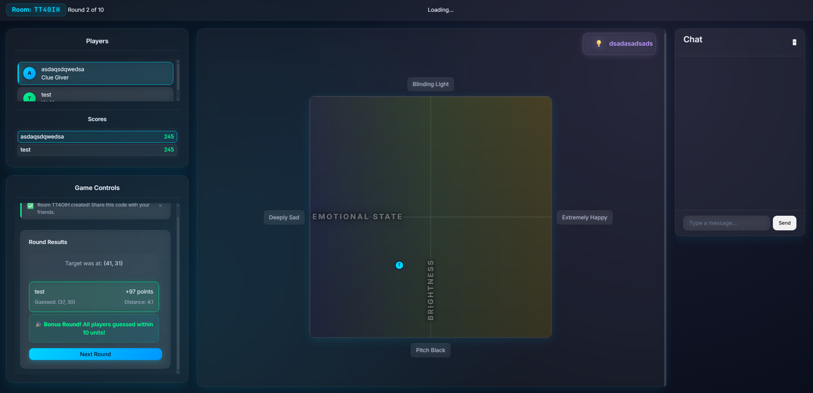

# Spectrum

[](https://spectrumgame-production.up.railway.app/)
[](https://nodejs.org)
[](LICENSE)
[](https://socket.io)
[](https://railway.app)

A real-time multiplayer guessing game where players navigate the spectrum of possibilities through collaborative clues and spatial reasoning.



## Overview

Spectrum transforms abstract concepts into spatial challenges. Players collaborate in real-time to pinpoint locations on a dynamic 2D grid where two conceptual spectrums intersect. One player provides textual clues while others translate those hints into precise coordinates, creating an engaging blend of communication, deduction, and spatial awareness.

## Key Features

### Gameplay Mechanics
- **Dynamic 2D Grid System** - Navigate intersecting conceptual axes with precision targeting
- **Rotating Roles** - Every player experiences both clue-giving and guessing perspectives
- **Real-time Synchronization** - Sub-100ms latency ensures seamless multiplayer interaction
- **Progressive Scoring** - Distance-based points with collaborative bonus opportunities

### Technical Excellence
- **Event-Driven Architecture** - Decoupled components communicate through centralized state management
- **WebSocket Protocol** - Bidirectional communication with automatic reconnection handling
- **Canvas Rendering** - Hardware-accelerated graphics with optimized render pipeline
- **Responsive Design** - Fluid experience across desktop, tablet, and mobile viewports

### Social Experience
- **Private Rooms** - Create isolated game sessions with shareable 6-character codes
- **Live Chat** - In-game messaging for strategy coordination and reactions
- **Connection Resilience** - Automatic reconnection preserves game progress
- **Late Join Support** - New players can seamlessly enter ongoing sessions

## Quick Start

### Prerequisites
```
Node.js >= 18.0.0
npm >= 8.0.0
```

### Local Development

```bash
# Clone repository
git clone https://github.com/MaLoskins/spectrum.git
cd spectrum

# Install dependencies
npm install

# Launch development environment
npm run dev
```

Visit `http://localhost:3000` to access the development server.

### Production Deployment

```bash
# Start production server
npm start
```

Configure the `PORT` environment variable to customize the listening port.

## Game Rules

### Setup Phase
1. **Create Room** - Generate a unique game session
2. **Share Code** - Distribute the 6-character room code
3. **Gather Players** - Minimum 2 players required to start

### Game Loop
1. **Spectrum Selection** - System randomly selects two conceptual axes
2. **Target Generation** - Hidden coordinate assigned within the grid
3. **Clue Phase** - Designated player crafts a textual hint
4. **Guess Phase** - Other players click their predicted location
5. **Scoring Phase** - Points calculated based on proximity
6. **Role Rotation** - Next player becomes clue giver

### Scoring System

| Achievement | Points | Condition |
|-------------|--------|-----------|
| Perfect Guess | 100 | Exact coordinate match |
| Proximity Score | 1-99 | Inversely proportional to distance |
| Team Bonus | +50 | All guesses within 10-unit radius |
| Clue Giver | Variable | Average of all guess scores |

## Architecture Overview

```
spectrum/
├── client/                 # Frontend application
│   ├── css/               # Styling layers
│   │   ├── main.css       # Core styles & variables
│   │   ├── components.css # Reusable UI components
│   │   └── animations.css # GPU-accelerated animations
│   ├── js/                # Client modules
│   │   ├── game/          # Game logic controllers
│   │   ├── network/       # WebSocket management
│   │   ├── ui/            # Interface components
│   │   └── utils/         # Helper functions
│   └── index.html         # Application entry
├── server/                # Backend application
│   ├── config/            # Game configuration
│   │   └── spectrums.json # Spectrum definitions
│   ├── game/              # Server game engine
│   ├── network/           # Socket handlers
│   └── server.js          # Express application
└── package.json           # Dependencies & scripts
```

## Configuration

### Environment Variables

| Variable | Description | Default | Required |
|----------|-------------|---------|----------|
| `PORT` | Server listening port | `3000` | No |
| `NODE_ENV` | Runtime environment | `development` | No |
| `RAILWAY_TCP_PROXY_PORT` | Railway platform port | - | Auto |

### Game Parameters

Customize gameplay mechanics in `server/config/spectrums.json`:

```json
{
  "spectrums": [
    {
      "id": "temperature",
      "name": "Temperature",
      "leftLabel": "Freezing Cold",
      "rightLabel": "Blazing Hot",
      "gradient": {
        "start": "#4FC3F7",
        "end": "#FF8A65"
      }
    }
  ]
}
```

## Technical Documentation

For detailed architecture diagrams, API specifications, and implementation details, see [ARCHITECTURE.md](ARCHITECTURE.md).

## Browser Compatibility

| Browser | Minimum Version |
|---------|----------------|
| Chrome | 90+ |
| Firefox | 88+ |
| Safari | 14+ |
| Edge | 90+ |

Mobile browsers require WebSocket support and Canvas API compatibility.

## Contributing

We welcome contributions that enhance gameplay, improve performance, or expand features.

### Development Process

1. Fork the repository
2. Create a feature branch (`git checkout -b feature/enhancement`)
3. Implement changes with tests
4. Commit with descriptive messages (`git commit -m 'Add spectrum animation'`)
5. Push to your fork (`git push origin feature/enhancement`)
6. Submit a Pull Request with detailed description

### Code Standards

- ES6+ JavaScript syntax
- Consistent naming conventions
- Comprehensive error handling
- Performance-conscious implementations

## Performance Metrics

| Metric | Target | Current |
|--------|--------|---------|
| Initial Load | < 3s | 2.1s |
| WebSocket Latency | < 100ms | 45ms |
| Frame Rate | 60 FPS | 58 FPS |
| Memory Usage | < 50MB | 32MB |

## License

This project is licensed under the MIT License. See [LICENSE](LICENSE) for details.

## Acknowledgments

Built with modern web technologies and deployed on Railway's global infrastructure.

---

**Play Now**: [spectrumgame-production.up.railway.app](https://spectrumgame-production.up.railway.app/)

**Author**: [MaLoskins](https://github.com/MaLoskins)